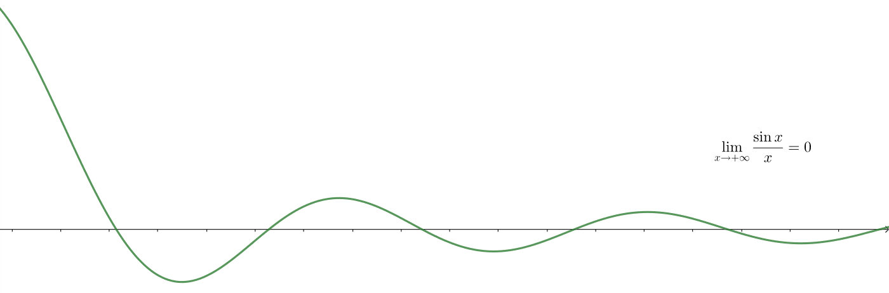
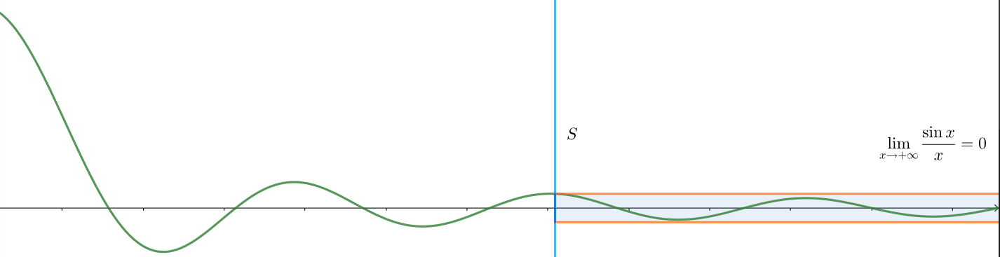
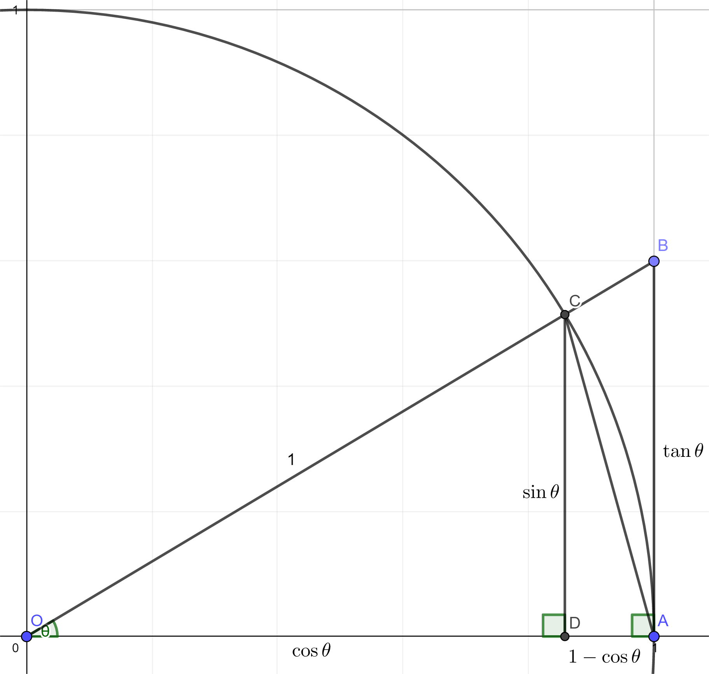

# 极限

对于数列 $\{a_n\}$，若在 $n$ 不断增大的过程中，$a_n$ 不断地逼近 $A$，  
则称 $A$ 为 $\{a_n\}$ 在 $n\rightarrow +\infty$ 时的 **数列极限**，记为

$$\lim_{n\rightarrow +\infty}a_n=A$$

对于函数 $f(x)$，若自变量 $x$ 不断逼近 $t$ 的过程中，$f(x)$ 的函数值不断地逼近 $A$，  
则称 $A$ 为 $f(x)$ 在 $x\rightarrow t$ 时的 **函数极限**，记为

$$\lim_{x\rightarrow t}f(x)=A$$

> 注意：“逼近”的意思是无限接近且永不相等。也就是说，对于一般的函数而言，  
> $\qquad\quad$ 极限的取值与该点的函数值没有联系。例如，对于分段函数
> $$f(x)=\begin{cases}2x+1&(x\not =1)\\4&(x=1)\end{cases}$$
> $\qquad\quad$ 我们有
> $$\lim_{x\rightarrow 1}f(x)=3$$
> “极限的取值与函数值相等”是函数自身的性质，称为 **连续性**，详见下文。

### 左右极限与 $\pm\infty$

实数轴上，极限的逼近是有方向的。从 $t$ 的左边，即数轴的负方向逼近的极限称为 **左极限**，记为

$$\lim_{x\rightarrow t^-} f(x)$$

相应地，从 $t$ 的右边，即数轴的正方向逼近的极限称为 **右极限**，记为

$$\lim_{x\rightarrow t^+} f(x)$$

我们通常所指的极限是从任意方向逼近的极限，即 **双侧极限**。  
也就是说，实数域上 $\displaystyle\lim_{x\rightarrow t}f(x)=A$ 的充要条件是

$$\lim_{x\rightarrow t^-} f(x)=\lim_{x\rightarrow t^+} f(x)=A$$

显然，$x\rightarrow+\infty$ 的极限是左极限，而 $x\rightarrow -\infty$ 的极限是右极限。  
若 $|x|\rightarrow +\infty$ 时，$f(x)\rightarrow A$，则称 $A$ 为 $f(x)\rightarrow\infty$ 时的极限，记为

$$\lim_{x\rightarrow\infty}f(x)=A$$

它是一个双侧极限。同样地，$\displaystyle\lim_{x\rightarrow\infty}f(x)=A$ 的充要条件是

$$\lim_{x\rightarrow+\infty}f(x)=\lim_{x\rightarrow-\infty}f(x)=A$$

$A$ 的取值同样有有限值，$\pm\infty$ 和 $\infty$（即 $|f(x)|\rightarrow+\infty$） 之分，于是实数域上有共计 $24$ 种函数极限的定义。

双侧极限显然可以推广到复数域或一般的欧几里得空间，称为极限的 **去心邻域定义**。    
而对于单侧极限，在一般的欧几里得空间中，我们直接通过函数的定义域对逼近方向作出限定，  
这称为极限的 **聚点定义**。例如对于

$$\lim_{(x,y)\rightarrow (0,0)}\dfrac{xy}{xy}$$

如果我们使用去心邻域定义，$\dfrac{xy}{xy}$ 在 $x$ 轴和 $y$ 轴都无定义，没法沿二者逼近到原点，极限不存在，  
但若使用聚点定义，我们只要沿着有定义的方向逼近即可，极限为 $1$ 。

未说明时，复变函数的极限均为去心邻域定义，多元函数的极限均为聚点定义。

### 极限的 $\epsilon-\delta$ 定义

接下来我们讨论如何严谨地定义极限。  
一个很自然的想法是，在 $x \rightarrow t$ 的过程中，$|f(x)-A|$ 不断减小。  
但这种减小未必是单调的，可以有一定的波动，例如

 

不过，虽然 $x\rightarrow t$ 的过程中 $|f(x)-A|$ 可能有波动，但 **减小的趋势是不可逆转的**。  
具体地，不论我们希望 $|f(x)-A|$ 有多小，都能找到 $t$ 附近的一个区域 $S$，  
使得当 $x$ 跨入区域 $S$ 后，$|f(x)-A|$ 始终有这么小。

 

这就是我们所要找的极限的定义了。如果找不到这样的区域 $S$，  
就意味着 $x\rightarrow t$ 时 $f(x)$ 不是逼近于 $A$，而是始终在 $A$ 附近一个确定的范围内波动。

用数学语言表达，就是 **极限的 $\epsilon-\delta$ 定义**：

$$\lim_{x\rightarrow t}f(x)=A\Leftrightarrow \forall\epsilon>0,\exist\delta>0,\forall|x-t|\in(0,\delta),|f(x)-A|<\epsilon$$

- $\epsilon$ 表示 $|f(x)-A|$ 的范围，即我们希望 $|f(x)-A|$ 有多小。
- $\delta$ 表示我们所找到的区域 $S$ 的大小。

数列极限以及其余各种函数极限的定义是类似的。  
例如对于多元函数极限的聚点定义，设 $f(\vec{x})$ 定义域为 $D$，则

$$\lim_{\vec{x}\rightarrow \vec{t}}f(\vec{x})=A\Leftrightarrow \forall\epsilon>0,\exist\delta>0,\forall x\in\{x\in D|\ |\vec{x}-\vec{t}|\in(0,\delta)\}\not =\varnothing,|f(\vec{x})-A|<\epsilon$$

## 一般的映射极限$^*$

极限的定义是多种多样的，仅仅是定义域（$\Z,\R,\mathbb{C}$ 或欧几里得空间 $\R^n$）,  
逼近方向（双侧（去心邻域），单侧（聚点）），逼近结果（有限值，$\pm\infty,\infty$）的不同，就会产生不同的极限定义。

让我们从最一般的角度考虑这些定义。从而统一地讨论它们。

### 极限过程与滤子基

首先讨论所谓的 **极限过程**，即自变量不断逼近的一般过程，其对应 $\epsilon-\delta$ 定义中的 $\delta$。

首先，极限过程并不局限于 $x\rightarrow t,x\rightarrow t^-,x\rightarrow t^+$ 等对某一点的逼近。例如

> 对于闭区间 $[a,b]$，若数列 $x_0,x_1,\cdots,x_n$ 满足
> $$a=x_0<x_1<\cdots<x_n=b$$
> 则称 $x_0,x_1,\cdots,x_n$ 为 $[a,b]$ 的一个 **分割**。  
> 对于 $[a,b]$ 的两个分割 $x_0,x_1,\cdots,x_n$ 和 $y_0,y_1,\cdots,y_m$，若 $n<m$，且
> $$\exists t_0,t_1,\cdots,t_n\in\N,\forall k\in[0,n]\cap\N,x_k=y_{t_k}$$
> 则称 $y_0,y_1,\cdots,y_m$ 比 $x_0,x_1,\cdots,x_n$ **更精细**。  
> 显然，“区间分割得越来越精细” 也是一个极限过程。

考虑这些极限过程的共性，可以发现，它们都依赖于一定的偏序关系：  
$x\rightarrow t$ 的过程是 $x$ 不断靠近 $t$ 的过程，而“更靠近”和“更精细”都是偏序关系。  

接下来考虑偏序关系对 $\epsilon-\delta$ 定义的影响，则可发现，偏序关系影响的是 “$t$ 附近的区域” $S$ 的定义：  
$S$ 应当是一个非空集合，满足对于其中的任意元素 $x$，比 $x$ “更靠近 $t$” 的所有点 $y$ 也都在 $S$ 中。   
例如，对于“区间分割得越来越精细”的极限过程，$S$ 就应该是 $[a,b]$ 的若干分割形成的非空集合，  
满足对于其中的任意分割 $x_0,x_1,\cdots,x_n$，比 $x_0,x_1,\cdots,x_n$ 更精细的所有分割 $y_0,y_1,\cdots,y_m$ 也都在 $S$ 中。

实际上，由于偏序关系总可以用若干集合间的包含关系表示，我们定义：  
对于集合 $X$ 的 **非空子集** 组成的集合 $\mathcal{B}$，若

$$\forall B_1,B_2\in\mathcal{B},\exist B\in\mathcal{B},B\subseteq B_1\cap B_2$$

则称 $\mathcal{B}$ 为 $X$ 上的 **滤子基**。

对于任意的极限过程，我们总能给出对应的偏序关系，从而导出相应的滤子基。  
以下是 $\R$ 上常见极限过程对应的滤子基：

|极限过程|滤子基 $\mathcal{B}$|
|---|---|
|$x\rightarrow t$|$\{(t-\delta,t)\cup(t,t+\delta)\|\delta>0\}$|
|$x\rightarrow t^+$|$\{(t,t+\delta)\|\delta>0\}$|
|$x\rightarrow t^-$|$\{(t-\delta,t)\|\delta>0\}$|
|$x\rightarrow +\infty$|$\{(\delta,+\infty)\|\delta>0\}$|
|$x\rightarrow -\infty$|$\{(-\infty,-\delta)\|\delta>0\}$|
|$x\rightarrow\infty$|$\{(-\infty,-\delta)\cap(\delta,+\infty)\|\delta>0\}$|
|$x\rightarrow +\infty$（数列极限）|$\{\N\cap(N,+\infty)\|N\in\N\}$|

### 拓扑空间与邻域

接下来刻画值域的所谓“邻近”，即值域的连续性。其对应 $\epsilon-\delta$ 定义中的 $\epsilon$ 。  
对于集合 $X$ 和 $\tau\subseteq 2^X$，若

- $\varnothing,X\in\tau$。
- $\tau$ 中任意个元素的并属于 $\tau$：$\forall S\subseteq\tau,\mathop{\bigcup}\limits_{A\in S}A\in\tau$。
- $\tau$ 中有限个元素的交属于 $\tau$：$\forall A,B\in\tau,A\cap B\in\tau$。

则称 $(X,\tau)$ 为 **拓扑空间**。$\tau$ 中的集合称为 **开集**。  
拓扑空间的核心意义在于“开集”这一概念。例如，要刻画实数集 $\R$ 的连续性，  
我们就将 $\R$ 上的开区间（以及它们的并）定义为开集，从而摒除那些不具备连续意义的 $\R$ 的子集。

度量空间（详见【模】（2）线性空间）是常用的拓扑空间。

在开集的基础上，对于拓扑空间 $(X,\tau)$ 中的某一点 $a\in X$ 和 $S\subseteq X$，若 

$$\exist T\in\tau,a\in T\subseteq S$$

则称 $S$ 为 $a$ 的一个 **邻域**。

将滤子基与邻域相结合，即可得到一般的 **映射极限**：

对于 $X$ 上的滤子基 $\mathcal{B}$，拓扑空间 $(Y,\tau)$ 以及映射 $f:X\rightarrow Y$ ，  
若对于 $a\in Y$ 的任意邻域 $V$，总存在 $B\in\mathcal{B}$，使得

$$\{f(x)|x\in B\}\subseteq V$$

则称 $a$ 为 $f$ 在基 $\mathcal{B}$ 上的极限，记为

$$\lim_{\mathcal{B}}f(x)=a$$

## 极限的性质

直接使用极限的定义来计算极限是相当困难的。但我们可以通过极限的定义来证明以下性质，进而简化极限的计算。

以实数域上的极限为例，我们有

1. $\displaystyle\lim_{\mathcal{B}} f(x)=a\in\R,\lim_{\mathcal{B}} g(x)=b\in\R\Rightarrow \lim_{\mathcal{B}} (f+g)(x)=a+b$
   > 证明：由极限的定义，$\displaystyle\lim_{\mathcal{B}} f(x)=a,\lim_{\mathcal{B}} g(x)=b$ 即  
   > $\qquad$对任意 $\epsilon_1,\epsilon_2>0$，存在 $B_1,B_2\in\mathcal{B}$ 使得
   > $$\forall x\in B_1,|f(x)-a|<\epsilon_1$$
   > $$\forall x\in B_2,|g(x)-b|<\epsilon_2$$
   > $\qquad$ 由滤子基的定义，存在 $B\in\mathcal{B}$，使得 $B\subseteq B_1\cap B_2$，于是
   > $$\forall x\in B,|f(x)-a|<\epsilon_1,|g(x)-B|<\epsilon_2$$
   > $\qquad$ 又由三角形不等式得
   > $$|(f(x)+g(x))-(a+b)|\le|f(x)-a|+|g(x)-b|$$
   > $\qquad$ 因此对于任意 $\epsilon>0$，令 $\epsilon_1=\epsilon_2=\dfrac{\epsilon}{2}$，即可使得
   > $$\forall x\in B,|(f(x)+g(x))-(a+b)|<\epsilon_1+\epsilon_2=\epsilon$$
   > $\qquad$ 由极限的定义，这就是 $\displaystyle\lim_{\mathcal{B}} (f+g)(x)=a+b$。
2. $\displaystyle\lim_{\mathcal{B}} f(x)=a\in\R,C\in\R\Rightarrow \lim_{\mathcal{B}} Cf(x)=Ca$
   > 证明：由极限的定义，$\displaystyle\lim_\mathcal{B} f(x)=a$ 即对任意 $\epsilon_0>0$，存在 $B\in\mathcal{B}$ 使得
   > $$\forall x\in B,|f(x)-a|<\epsilon_0$$
   > $\qquad$ 因此对于任意 $\epsilon>0$，令 $\epsilon_0=\dfrac{\epsilon}{|C|+1}$，即可使得
   > $$\forall x\in B,|Cf(x)-Ca|=|C||f(x)-a|<|C|\epsilon_0=\dfrac{|C|\epsilon}{|C|+1}\le\epsilon$$
   > $\qquad$ 由极限的定义，这就是 $\displaystyle\lim_{\mathcal{B}} Cf(x)=Ca$。
3. $\displaystyle\lim_{\mathcal{B}} f(x)=a\in\R,\lim_{\mathcal{B}} g(x)=b\in\R\Rightarrow \lim_{\mathcal{B}} (f\times g)(x)=ab$
	> 证明：与 1. 类似，对于任意的 $\epsilon>0$，只需要找到 $\epsilon_1,\epsilon_2>0$，使得  
	> $$|f(x)-a|<\epsilon_1,|g(x)-b|<\epsilon_2\Rightarrow |f(x)g(x)-ab|<\epsilon\qquad(1)$$
	> $\qquad$ 注意到
	> $$|f(x)g(x)-ab|=|(f(x)-a)(g(x)-b)+b(f(x)-a)+a(g(x)-b)|$$
	> $$\le|f(x)-a||g(x)-b|+|b||f(x)-a|+|a||g(x)-b|$$
	> $$<\epsilon_1\epsilon_2+|b|\epsilon_1+|a|\epsilon_2$$
	> $\qquad$ 于是令
	> $$\epsilon_1=\epsilon_2=\dfrac{\sqrt{(|a|+|b|)^2+4\epsilon}-|a|-|b|}{2}$$
	> $\qquad$ 即可让 $\epsilon_1\epsilon_2+|b|\epsilon_1+|a|\epsilon_2=\epsilon$，从而使得 $(1)$ 式成立。
4. $\displaystyle\lim_{\mathcal{B}} f(x)=a\in\R\ (a\not =0)\Rightarrow\lim_{\mathcal{B}}\dfrac{1}{f(x)}=\dfrac{1}{a}$
    > 证明：同 2.，对于任意的 $\epsilon>0$，只需要找到 $\epsilon_0>0$，使得
	> $$|f(x)-a|<\epsilon_0\Rightarrow\left|\dfrac{1}{f(x)}-\dfrac{1}{a}\right|<\epsilon\qquad(2)$$
	> $\qquad$ 首先，当 $\epsilon_0<|a|$ 时，由于 $|f(x)-a|<|a|$，有
	> $$\left|\dfrac{1}{f(x)}-\dfrac{1}{a}\right|=\dfrac{|a-f(x)|}{|af(x)|}<\dfrac{\epsilon_0}{|a||f(x)|}$$
	> $$=\dfrac{\epsilon_0}{|a||-a-(f(x)-a)|}<\dfrac{\epsilon_0}{|a|(|-a|-|f(x)-a|)}=\dfrac{\epsilon_0}{|a|(|a|-\epsilon_0)}$$
	> $\qquad$ 于是令
	> $$\epsilon_0=|a|\left(1-\dfrac{1}{1+\epsilon|a|}\right)$$
	> $\qquad$ 显然这可以满足
	> $$0<\epsilon_0<|a|,\dfrac{\epsilon_0}{|a|(|a|-\epsilon_0)}=\epsilon$$
	> $\qquad$ 从而使得 $(2)$ 式成立。

而对于一般的映射极限，我们有

1. > 极限的唯一性*：对于拓扑空间 $(Y,\tau)$，若对于其中任意两个不同的点 $u,v\in X$，  
   > $\qquad\qquad\quad$ 总存在 $u$ 的邻域 $U$，$v$ 的邻域 $V$，使得 $U\cap V\not =\varnothing$，则称 $(Y,\tau)$ 为 **豪斯多夫空间**。  
   > $\qquad\qquad\quad$ 当 $(Y,\tau)$ 为豪斯多夫空间时，对于映射 $f:X\rightarrow Y$，  
   > $\qquad\qquad\quad$ 若 $f$ 在基 $\mathcal{B}$ 上的极限存在，则它是唯一的。  
   > 证明：设 $u,v$ 均为 $f$ 在基 $\mathcal{B}$ 上的极限，且 $u\not =v$，由映射极限的定义得  
   > $\qquad$ 对于 $u$ 在 $Y$ 上的任意邻域 $U$ 和 $v$ 在 $Y$ 上的任意邻域 $V$，
   > $$\exists B_1\in\mathcal{B},\{f(x)|x\in B_1\}\subseteq U$$
   > $$\exists B_2\in\mathcal{B},\{f(x)|x\in B_2\}\subseteq V$$
   > $\qquad$ 由滤子基的定义，存在 $B\in\mathcal{B}$，使得 $B\subseteq B_1\cap B_2$，于是
   > $$\{f(x)|x\in B\}\subseteq \{f(x)|x\in B_1\}\cap\{f(x)|x\in B_2\}\subseteq U\cap V$$
   > $\qquad$ 由于 $(Y,\tau)$ 是豪斯多夫空间，存在 $U,V$ 使得 $U\cap V=\varnothing$，此时
   > $$\{f(x)|x\in B\}\subseteq\varnothing$$
   > $\qquad$ 这说明 $B$ 是空集，但由滤子基的定义，$\mathcal{B}$ 中元素均为 $X$ 的非空子集，  
   > $\qquad$ 产生矛盾，因此 $f$ 在基 $\mathcal{B}$ 上的极限是唯一的。   
   > $\R^n$ 是典型的豪斯多夫空间，因此其上的极限是唯一的。但并不是所有的拓扑空间都是豪斯多夫空间，例如
   > $$\tau=\{\varnothing,Y\},|Y|\ge 3$$  
   > 以它们为值域的映射不满足极限的唯一性。 
2. > 复合映射的极限：设 $(Z,\tau_Z)$ 为拓扑空间，$\mathcal{B}_X,\mathcal{B}_Y$ 分别为 $X,Y$ 上的滤子基。若对于映射      
   > $\qquad\qquad\qquad\quad f:X\rightarrow Y$ 和 $g:Y\rightarrow Z$，$g$ 在基 $\mathcal{B}_Y$ 上的极限存在，且
   > $$\forall B_Y\in\mathcal{B}_Y,\exist B_X\in\mathcal{B}_X,\{f(x)|x\in B_X\}\subseteq B_Y\qquad(3)$$
   > $\qquad\qquad\qquad\quad$ 则 $g\circ f$ 在基 $\mathcal{B}_X$ 上的极限存在，且
   > $$\lim_{\mathcal{B}_X}(g\circ f)(x)=\lim_{\mathcal{B}_Y}g(y)$$
   > 证明：设 $\displaystyle\lim_{\mathcal{B}_Y}g(y)=a$，由映射极限的定义，对于 $a$ 的任意邻域 $V$，存在 $B_Y\in\mathcal{B}_Y$ 使得
   > $$\{g(y)|y\in B_Y\}\subseteq V$$
   > $\qquad\quad$ 相应的，由题意，对于任意的 $B_Y\in\mathcal{B}_Y$，总存在 $B_X\in\mathcal{B}_X$ 使得
   > $$\{f(x)|x\in\mathcal{B}_X\}\subseteq B_Y$$
   > $\qquad\quad$ 因此对于 $a$ 的任意邻域 $V$，总存在 $B_Y\in\mathcal{B}_Y,B_X\in\mathcal{B}_X$ 使得
   > $$\{(g\circ f)(x)|x\in B_X\}\subseteq\{g(y)|y\in B_Y\}\subseteq V$$
   > $\qquad\quad$ 由映射极限的定义，这就是 $\displaystyle\lim_{\mathcal{B}_X}(g\circ f)(x)=a$ 。  
   > 复合映射的极限需要 $\mathcal{B}_X,\mathcal{B}_Y$ 满足条件 $(3)$。这意味着
   > $$\lim_{x\rightarrow t} f(x)=a,\lim_{x\rightarrow a}g(x)=b\Rightarrow \lim_{x\rightarrow t} (g\circ f)(x)=b\quad(4)$$
   > 并不成立，例如
   > $$f(x)=x\sin\dfrac{1}{x},g(x)=\begin{cases}0&(x\not =0)\\1&(x=0)\end{cases}$$
   > 虽然 $\displaystyle\lim_{x\rightarrow 0}f(x)=\lim_{x\rightarrow 0} g(x)=0$，但 $\displaystyle\lim_{x\rightarrow 0}g(f(x))$ 不存在，原因是 $f(x)$ 在 $0$ 附近剧烈振荡。  
   > 但若加上条件 "$f(x)$ 不在 $t$ 附近剧烈振荡"，即
   > $$\exist\delta>0,\forall |x-t|\in(0,\delta),|f(x)-a|>0$$
   > 即可使 $(4)$ 成立。

以上所有的性质在实数域上使用 $\epsilon-\delta$ 定义证明是一样的，使用滤子基只是为了方便讨论。

> 拓展*：对于拓扑空间 $(P,\tau)$，若 $P$ 是域（详见【环】（1）整数环），  
> $\qquad\quad$ 且其加法和乘法是连续映射（详见下文），则称 $(P,\tau)$ 为 **拓扑域**。  
> $\qquad\quad$ 试将实数域上极限的运算律推广到一般的拓扑域上并证明。  
> $\qquad\quad$ 相应的，可以定义拓扑域上的 **拓扑线性空间**（详见【模】（2）线性空间）。   
> $\qquad\quad$ 试将实数域上极限的运算律 1.2. 推广到一般的拓扑线性空间上并证明。

### 夹逼定理与重要极限

对于 $\R$ 上的极限，我们有

> **夹逼定理**：若 $\displaystyle\lim_{\mathcal{B}} f(x)=\lim_{\mathcal{B}}g(x)=a$，且
>  $$\exist B\in\mathcal{B},\forall x\in B,f(x)\le h(x)\le g(x)$$
> 则 $\displaystyle\lim_{\mathcal{B}} h(x)=a$。  
> 证明：由极限的定义，$\displaystyle\lim_{\mathcal{B}} f(x)=\lim_{\mathcal{B}}g(x)=a$ 即  
> $\qquad\quad$ 对于任意 $\epsilon>0$，存在 $B_1,B_2\in\mathcal{B}$ 使得
> $$\forall x\in B_1,|f(x)-a|<\epsilon$$
> $$\forall x\in B_2,|g(x)-a|<\epsilon$$
> $\qquad\quad$ 由滤子基的定义，存在 $B_3\in\mathcal{B},B_3\subseteq B_1\cap B_2\cap B$，于是
> $$\forall x\in B_3,a-\epsilon<f(x)\le h(x)\le g(x)<a+\epsilon$$
> $$\forall x\in B_3,|h(x)-a|<\epsilon$$
> $\qquad\quad$ 由极限的定义，这就是 $\displaystyle\lim_{\mathcal{B}}h(x)=a$ 。

应用夹逼定理，可以证明以下两个重要极限，它们会在微积分中用到：

1. $\displaystyle\lim_{x\rightarrow 0}\dfrac{\sin x}{x}=1,\lim_{x\rightarrow 0}\dfrac{1-\cos x}{x}=0$
   > 证明：如图所示。
   >  
   > 当 $\theta\in(0,\dfrac{\pi}{2})$ 时，恒有
   > $$S_{\triangle AOC}<S_{\texttt{扇形}AOC}<S_{\triangle AOB}$$
   > 即
   > $$\dfrac{1}{2}\sin\theta<\dfrac{1}{2}\theta<\dfrac{1}{2}\tan\theta$$
   > $$\sin\theta<\theta<\tan\theta$$
   > $$\cos\theta<\dfrac{\sin\theta}{\theta}<1$$
   > $\displaystyle\lim_{x\rightarrow 0^+}\cos x=\lim_{x\rightarrow 0^+}1=1$，故由夹逼定理得 $\displaystyle\lim_{x\rightarrow 0^+}\dfrac{\sin x}{x}=1$ 。同时
   > $$\lim_{x\rightarrow 0^-}\dfrac{\sin x}{x}=\lim_{x\rightarrow 0^+}\dfrac{\sin(-x)}{-x}=\lim_{x\rightarrow 0^+}\dfrac{\sin x}{x}=1$$
   > 于是 $\displaystyle\lim_{x\rightarrow 0}\dfrac{\sin x}{x}=1$。因此
   > $$\lim_{x\rightarrow 0}\dfrac{1-\cos x}{x}=\lim_{x\rightarrow 0}\dfrac{\dfrac{1}{2}\sin^2\dfrac{x}{2}}{x}=\dfrac{1}{4}\left(\lim_{x\rightarrow 0}\sin\dfrac{x}{2}\right)\lim_{x\rightarrow 0}\dfrac{\sin\dfrac{x}{2}}{\dfrac{x}{2}}=\dfrac{1}{4}\times 0\times 1=0$$
2. $\displaystyle\lim_{x\rightarrow\infty}\left(1+\dfrac{1}{x}\right)^x=e$（$e$ 的定义式）
   > 存在性证明：首先证明数列极限 $\displaystyle e=\lim_{n\rightarrow+\infty}\left(1+\dfrac{1}{n}\right)^n$ 收敛。
   > >证明：设 $a_n=\left(1+\dfrac{1}{n}\right)^n\ (n\in\N)$，由二项式定理得
   > >$$a_n=\sum_{k=0}^n\dbinom{n}{k}\dfrac{1}{n^k}=\sum_{k=0}^n\dfrac{1}{k!}\times\dfrac{n^{\underline{k}}}{n^k}=\sum_{k=0}^n\dfrac{1}{k!}\prod_{i=0}^{k-1}\dfrac{n-i}{n}=\sum_{k=0}^n\dfrac{1}{k!}\prod_{i=0}^{k-1}\left(1-\dfrac{i}{n}\right)$$
   > >注意到
   > > $$\forall i\in[0,n)\cap\N,0<1-\dfrac{i}{n}<1-\dfrac{i}{n+1}$$
   > > 因此
   > > $$\forall k\in[0,n]\cap\N,0<\prod_{i=0}^{k-1}\left(1-\dfrac{i}{n}\right)<\prod_{i=0}^{k-1}\left(1-\dfrac{i}{n+1}\right)$$
   > > 又因为 $\dfrac{n^{\underline{n}}}{n!n^n}>0$ 恒成立，故 $a_n<a_{n+1}$，即数列 $a$ 单调递增。又
   > > $$\forall k\in[0,n]\cap\N,2^{k-1}\le k!,1-\dfrac{k}{n}<1$$
   > > 所以
   > >$$a_n<\sum_{k=0}^n\dfrac{1}{k!}\le\sum_{k=0}^n2^{1-k}=\dfrac{2^{-n}-2^{}}{2^{-1}-1}=4-2^{1-n}<4$$
   > > 因此单调递增数列 $a$ 存在上界 $4$。故 $\displaystyle\lim_{n\rightarrow+\infty}a_n$ 收敛。  
   >
   > 接下来，用数列极限证明对应的函数极限收敛。$x\ge 1$ 时，设 $n=\left\lfloor x\right\rfloor$，则
   > $$\left(1+\dfrac{1}{n+1}\right)^n<\left(1+\dfrac{1}{x}\right)^x<\left(1+\dfrac{1}{n}\right)^{n+1}$$
   > 而
   > $$\lim_{n\rightarrow+\infty}\left(1+\dfrac{1}{n}\right)^{n+1}=\left(\lim_{n\rightarrow+\infty}\left(1+\dfrac{1}{n}\right)\right)\lim_{n\rightarrow+\infty}\left(1+\dfrac{1}{n}\right)^n=1\times e=e$$
   > $$\lim_{n\rightarrow+\infty}\left(1+\dfrac{1}{n+1}\right)^{n}=\dfrac{\displaystyle\lim_{n\rightarrow+\infty}\left(1+\dfrac{1}{n+1}\right)^{n+1}}{\displaystyle\lim_{n\rightarrow+\infty}\left(1+\dfrac{1}{n+1}\right)}=\dfrac{e}{1}=e$$
   > 故由夹逼定理得 $\displaystyle\lim_{x\rightarrow+\infty}\left(1+\dfrac{1}{x}\right)^x=e$ 。$x\le -1$ 时，注意到 $\forall n\in \N_{+}$，
   > $$\left(1-\dfrac{1}{n}\right)^{-n}=\left(\dfrac{n-1}{n}\right)^{-n}=\left(\dfrac{n}{n-1}\right)^{n}=\left(1+\dfrac{1}{n-1}\right)^{n}$$
   > 因此 $\displaystyle\lim_{n\rightarrow+\infty}\left(1-\dfrac{1}{n}\right)^{-n}=\lim_{n\rightarrow+\infty}\left(1+\dfrac{1}{n-1}\right)^{n}=\lim_{n\rightarrow+\infty}\left(1+\dfrac{1}{n}\right)^{n+1}=e$，  
   > 采用与 $x\ge 1$ 时类似的夹逼即可得到 $\displaystyle\lim_{x\rightarrow-\infty}\left(1+\dfrac{1}{x}\right)^x=e$。  
   > 综上，$\displaystyle\lim_{x\rightarrow\infty}\left(1+\dfrac{1}{x}\right)^x=\lim_{x\rightarrow+\infty}\left(1+\dfrac{1}{x}\right)^x=\lim_{x\rightarrow-\infty}\left(1+\dfrac{1}{x}\right)^x=e$。

## 连续

对于一元实函数 $f(x)$，我们经常描述其图象为“一条连续不断的曲线”；  
对于二元函数 $f(x,y)$，我们也往往描述其图象为“一片连续不断的曲面”，  
这都用到了连续性。

设 $f:X\rightarrow Y$ 为拓扑空间 $(X,\tau_X)$ 到拓扑空间 $(Y,\tau_Y)$ 的映射，对于 $a\in X$，  
若对于 $f(a)$ 的任意邻域 $V$，总存在 $a$ 的邻域 $U$，使得

$$\{f(x)|x\in U\}\subseteq V$$

则称 $f(x)$ 在 $a$ 处 **连续**。

也就是说，设 $\mathcal{B}$ 为 $a$ 的所有邻域构成的集合，则

$$\lim_{\mathcal{B}}f(x)=f(a)$$

即，连续性就是映射的极限值与映射值相等的性质。

- 对于一元函数，$f(x)$ 在 $a$ 处连续就是 $\displaystyle\lim_{x\rightarrow a}f(x)=f(a)$ 
- 对于多元函数，$f(\vec{x})$ 在 $\vec{a}$ 处连续就是 $\displaystyle\lim_{x\rightarrow\vec{a}}f(x)=f(\vec{a})$

与极限一样，我们可以定义单侧连续的概念，于是

- 一元（多元）函数在开区间（区域）上连续当且仅当该区间（区域）内每一点都连续
- 一元（多元）函数在闭区间（区域）上连续当且仅当该区间（区域）内在每一点都连续，  
  且在该区间（区域）的边界上每一点都单侧连续。

结合极限的性质可得，连续函数的和、差、积、商仍是连续函数，连续映射的复合仍是连续映射。  
由于基本初等函数（幂函数、指数函数、对数函数、三角函数、反三角函数）都是连续的，  
故 **一切初等函数都在定义域内连续**。

闭区间（区域）上的一元（多元）连续实值函数满足以下两条关键性质：

1. **最大最小值定理**：闭区间（区域）上的一元（多元）连续实值函数必然存在最大值和最小值（统称最值）。
2. **介值定理**：设闭区间（区域）$D$ 上的一元（多元）连续实值函数 $f$ 的最大值为 $M$，最小值为 $m$，则
   $$\{f(x)|x\in D\}=\{y\in\R|m\le y\le M\}$$
    对于 $\R$ 上一元函数，该定理等价于
	> **零点存在定理**：若函数 $f:[a,b]\rightarrow\R$ 连续，且 $f(a)f(b)<0$，则 $f(x)$ 在 $(a,b)$ 内存在零点。  
	> 等价性证明：零点存在定理显然对于介值定理是必要条件，现证其充分性。  
	> $\qquad\qquad$ 首先证明，$[a,b]$ 上的连续实值函数 $f(x)$ 可取 $f(a)$ 和 $f(b)$ 之间（包含 $f(a),f(b)$）的任何值。
	> > 证明：对于 $f(a)$ 和 $f(b)$ 之间（包含 $f(a),f(b)$）的任意实数 $\eta$，  
	> > $\qquad\qquad$ 我们需要找到 $\xi\in[a,b]$，使得 $f(\xi)=\eta$。  
	> > $\qquad\qquad$ 若 $\eta=f(a)$ 或 $f(b)$，取 $\xi=a$ 或 $b$ 即可。否则，设
	> > $$g(x)=f(x)-\eta$$
	> > $\qquad\qquad$ 显然 $g(a)=f(a)-\eta$ 和 $g(b)-f(b)-\eta$ 异号。由零点存在定理，  
	> > $\qquad\qquad g(x)$ 一定存在零点，这个零点就是我们要找的 $\xi$ 。  
	> 
	> $\qquad\qquad$ 在此基础上，设 $[a,b]$ 上 $f(x)$ 在 $x_M$ 取最大值，在 $x_m$ 取最小值，$x_m\le x_M$ 时，有
	> $$\{f(x)|x\in[a,b]\}=\{f(x)|a\le x\le x_m\}\cup\{f(x)|x_m\le x\le x_M\}\cup\{f(x)|x_m\le x\le b\}$$
	> $$=\{y\in\R|m\le y\le f(a)\}\cup\{y\in\R|m\le y\le M\}\cup\{y\in\R|f(b)\le y\le M\}$$
	> $$=\{y\in\R|m\le y\le M\}$$
	> $\qquad\qquad x_m\ge x_M$ 时是类似的。

# 渐进

渐进是极限的一种等价表述。

以算法复杂度中常用的 **大 $\Omicron$ 记号** 为例。我们说

$$f(x)=\Omicron(g(x))\qquad(x\rightarrow t)$$

指的是存在常数 $C>0$，使得当 $x$ 足够接近 $t$ 时，恒有

$$|f(x)|\le C|g(x)|$$

相应的，我们还有以下的渐进符号：

- $f(x)=\omicron(g(x))\quad(x\rightarrow t)\Leftrightarrow\forall C>0,x\rightarrow t$ 时，$|f(x)|\le C|g(x)|$
- $f(x)=\Omega(g(x))\quad(x\rightarrow t)\Leftrightarrow\exist C>0,x\rightarrow t$ 时，$|f(x)|\ge C|g(x)|$
- $f(x)=\omega(g(x))\quad(x\rightarrow t)\Leftrightarrow\forall C>0,x\rightarrow t$ 时，$|f(x)|\ge C|g(x)|$
- $f(x)=\Theta(g(x))\quad(x\rightarrow t)\Leftrightarrow\exist C_1,C_2>0,x\rightarrow t$ 时，$C_1|g(x)|\le|f(x)|\le C_2|g(x)|$ 

$\Omicron,\omicron,\Omega,\omega,\Theta$ 分别对应数的 $\le,<,\ge,>,=$。

>注意：  
>1. 使用渐进符号时要注明自变量趋近的值和趋近方式（即所使用的滤子基 $\mathcal{B}$）
>2. 在处理渐进符号时，我们处理的是单向等式。也就是说，$\omicron(g(x))\ (x\rightarrow t)$ 其实是函数集合
>    $$\{f(x)|\forall C>0,\exist\delta>0,\forall|x-t|\in(0,\delta),|f(x)|\le C|g(x)|\}$$
>     而 $f(x)=\omicron(g(x))$ 中的等号实际上应该是 $\in$ 或 $\subseteq$，只是习惯上用等号表示罢了。

### 与极限的关系

极限可以无条件地转换为对应的渐进记号，即

$$
\lim_{x\rightarrow t}\dfrac{|f(x)|}{|g(x)|}=0\Rightarrow f(x)=\omicron(g(x))\quad(x\rightarrow t)\quad(5)\\
\lim_{x\rightarrow t}\dfrac{|f(x)|}{|g(x)|}=+\infty\Rightarrow f(x)=\omega(g(x))\quad(x\rightarrow t)\quad(6)\\
\lim_{x\rightarrow t}\dfrac{|f(x)|}{|g(x)|}=C>0\Rightarrow f(x)=\Theta(g(x))\quad(x\rightarrow t)\\
\lim_{x\rightarrow t}\dfrac{|f(x)|}{|g(x)|}\not =+\infty\Rightarrow f(x)=\Omicron(g(x))\quad(x\rightarrow t)\\
\lim_{x\rightarrow t}\dfrac{|f(x)|}{|g(x)|}\not =0\Rightarrow f(x)=\Omega(g(x))\quad(x\rightarrow t)\\
$$

证明从略，留给读者作为练习。  
但反之则不然。一方面，$|g(x)|$ 可能为 $0$ 。如果趋近过程中 $|g(x)|$ 始终非 $0$，即

$$\exists\delta>0,\forall|x-t|\in(0,\delta),|g(x)|>0$$

那么 $(5)(6)$ 对应的反向转换是成立的。   
另一方面，$\displaystyle\lim_{x\rightarrow t}\dfrac{|f(x)|}{|g(x)|}=L$ 未必存在，若已知 $\dfrac{|f(x)|}{|g(x)|}$ 收敛或趋于 $+\infty$，那么以上所有式子对应的反向转换均成立。

### 渐进的运算 

以上所有的渐进符号均满足传递性，以 $\Omicron$ 为例，即

$$f(x)=\Omicron(g(x)),g(x)=\Omicron(h(x))\Rightarrow f(x)=\Omicron(h(x))$$

也即

$$\Omicron(\Omicron(h(x)))=\Omicron(h(x))$$

$\Omicron,\omicron,\Omega,\omega,\Theta$ 之间的关系与 $\le,<,\ge,>,=$ 之间的关系类似，即

$$f(x)=\Omicron(g(x))\Leftrightarrow g(x)=\Omega(f(x))$$

$$f(x)=\omicron(g(x))\Leftrightarrow g(x)=\omega(f(x))$$

$$f(x)=\Theta(g(x))\Leftrightarrow g(x)=\Theta(f(x))$$

$$f(x)=\omicron(g(x))\lor f(x)=\Theta(g(x))\Rightarrow f(x)=\Omicron(g(x))\quad(7)$$

$$f(x)=\omega(g(x))\lor f(x)=\Theta(g(x))\Rightarrow f(x)=\Omega(g(x))\quad(8)$$

$$f(x)=\Omicron(g(x))\land f(x)=\Omega(g(x))\Leftrightarrow f(x)=\Theta(g(x))$$

注意 $(7)(8)$ 反方向并不成立。

对于四则运算，以 $\Omicron,\Omega$ 为例，我们有以下运算律：

1. $\Omicron(f(x))+\Omicron(g(x))=\Omicron(|f(x)|+|g(x)|)=\Omicron(\max(|f(x)|,|g(x)|))$  
   $\Omega(f(x))+\Omega(g(x))=\Omega(|f(x)|+|g(x)|)=\Omega(\min(|f(x)|,|g(x)|))$   
   也就是说，函数增长的速度只由增长最快的部分决定，下降的速度只由下降最慢的速度决定。
2. $C\Omicron(f(x))=\Omicron(Cf(x))=\Omicron(f(x)),C\Omega(f(x))=\Omega(Cf(x))=\Omega(f(x))\quad(C>0)$  
   也就是说，渐进记号具有常数无关性。
3. $\Omicron(g(x)h(x))=g(x)\Omicron(h(x))$  
   $\Omega(g(x)h(x))=g(x)\Omega(h(x))$  
   若 $g(x)$ 在趋近过程中始终有定义，反向亦成立。  
   也就是说，渐进记号支持任意的乘除。

$\omicron,\omega$ 是类似的。

以上运算律证明从略，留给读者作为练习。

### 主定理

在计算算法的复杂度时，我们往往会遇到复杂度的递推式（如多项式牛顿迭代）。

如果有递推式

$$T(n)=aT\left(\dfrac{n}{b}\right)+f(n)\quad(a\ge 1,b>1)$$

也就是说，我们将一个规模为 $n$ 的问题转化为 $a$ 个 $\dfrac{n}{b}$ 规模的子问题，并用 $f(n)$ 的代价将这些子问题合并。 

对于该递推式，分类讨论得

1. $f(n)=\Omicron(n^{\log_ba-\epsilon})\quad(\epsilon>0)\Rightarrow T(n)=\Theta(n^{\log_ba})$
2. $f(n)=\Theta(n^{\log_ba})\Rightarrow T(n)=\Theta(n^{\log_ba}\log n)$
3. $f(n)=\Omega(n^{\log_ba+\epsilon})\quad(\epsilon>0),\exists c<1,af\left(\dfrac{n}{b}\right)\le cf(n)\Rightarrow T(n)=\Theta(f(n))$

这就是所谓的 **主定理**。