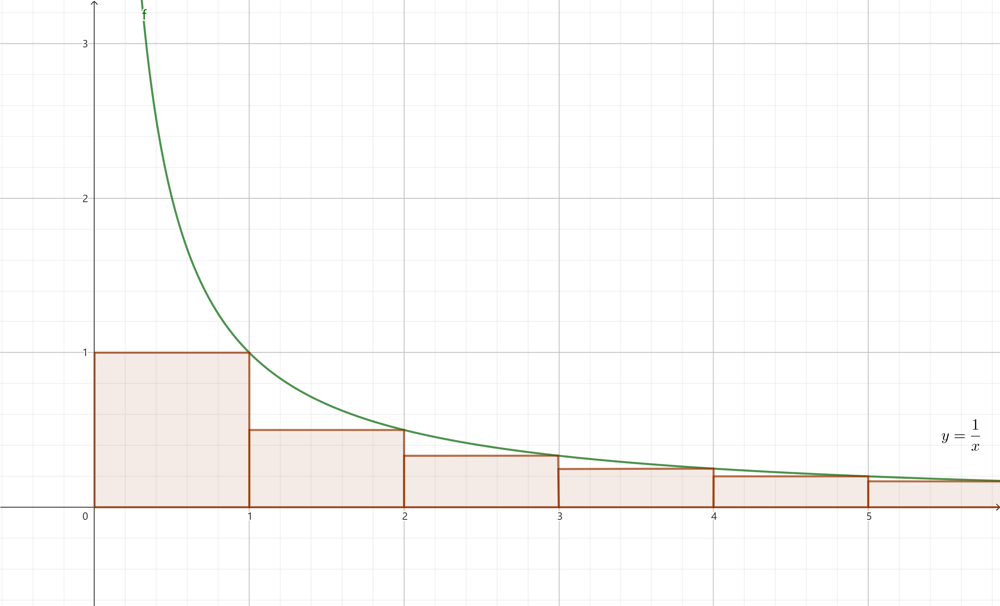
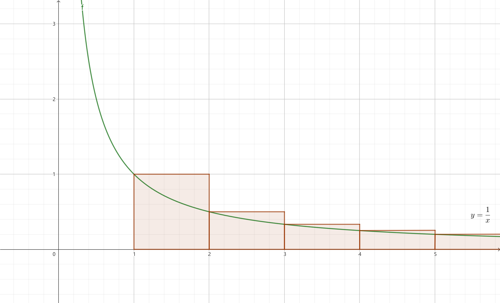

# 有限微积分

## 差分

$$\Delta f(x)=f(x+1)-f(x)$$

意思是，$\Delta f(x)$ 是一个新的函数，它等于 $f(x)$ 的差。

### 差分的运算律

若 $u,v$ 的差分均存在，则有以下运算律成立：

- 线性性：$\Delta(au+bv)=a\Delta u+b\Delta v\quad(a,b\in\mathbb{C})$
  > 证明：$\Delta(af(x)+bg(x))=af(x+1)+bg(x+1)-af(x)-bg(x)$  
  > $\qquad=a(f(x+1)-f(x))+b(g(x+1)-g(x))=a\Delta f(x)+b\Delta g(x)$
- 乘法法则：$\Delta(uv)=u\Delta v+\mathrm{E}v\Delta u$  
  其中 $\mathrm{E}f(x)=f(x+1)$。
  > 证明：$\Delta(f(x)g(x))=f(x+1)g(x+1)-f(x)g(x)$  
  > $\qquad=f(x+1)g(x+1)-f(x)g(x+1)+f(x)g(x+1)-f(x)g(x)$  
  > $\qquad=(f(x+1)-f(x))g(x+1)+f(x)(g(x+1)-g(x))$  
  > $\qquad=f(x)(g(x+1)-g(x))+(f(x+1)-f(x))g(x+1)$  
  > $\qquad=f(x)\Delta g(x)+\mathrm{E}g(x)\Delta f(x)$

### 基本差分公式与下降幂

指数函数的差分由差分的定义可得

$$\Delta(a^x)=(a-1)a^x$$

对于幂函数的差分，我们定义所谓的 **下降幂**

$$x^{\underline{n}}=\begin{cases}
	x(x-1)\cdots(x-n+1)&(n>0)\\
	1&(n=0)\\
	\dfrac{1}{(x+1)(x+2)\cdots(x+(-n))}&(n<0)
\end{cases}$$

则

$$\Delta(x^{\underline{n}})=nx^{\underline{n-1}}$$

下降幂多项式可以用多项式乘法唯一转化为普通幂多项式，  
而普通幂多项式亦可以用多项式除法唯一转化为下降幂多项式。

### 高阶差分与牛顿插值

我们定义所谓的 **高阶差分**

$$\Delta^0 f=f,\Delta^n f=\Delta(\Delta^{n-1}f)\quad(n\in\N_+)$$

由线性代数的知识可知，函数可以视为向量，$\Delta,\mathrm{E}$ 可视为矩阵，故

$$\Delta=\mathrm{E}-1$$

$$\Delta^nf(x)=(\mathrm{E}-1)^nf(x)=\sum_{k=0}^n\dbinom{n}{k}(-1)^{n-k}\mathrm{E}^kf(x)$$

$$\Delta^nf(x)=\sum_{k=0}^n\dbinom{n}{k}(-1)^{n-k}f(x+k)$$

因此我们可以 $\Theta(n)$ 求出函数的 $n$ 阶差分的某一项。

对于下降幂级数 $f(x)=\displaystyle\sum_{k=0}^{+\infty} a_kx^{\underline{k}}$，我们有

$$\Delta^nf(0)=n!a_n$$

因此

$$f(x)=\sum_{k=0}^{+\infty}\dfrac{\Delta^kf(0)}{k!}x^{\underline{k}}=\sum_{k=0}^{+\infty}\dfrac{\Delta^kf(0)}{k!}x^{\underline{k}}=\sum_{k=0}^{+\infty}\dbinom{x}{k}\Delta^kf(0)$$

对该式作一下平移，得

$$f(x)=\sum_{k=0}^{+\infty}\dbinom{x-x_0}{k}\Delta^kf(x_0)$$

我们称形如 $\displaystyle\sum_{k=0}^{+\infty}b_k\dbinom{x}{k}$ 的级数为 **牛顿级数**，而上式被称为 **等间距牛顿插值公式**。

### 偏差分与高维差分

对于二元函数 $f(x,y)$，我们可以分别定义其对 $x,y$ 的 **偏差分**

$$\Delta_x f(x,y)=f(x+1,y)-f(x,y)$$

$$\Delta_y f(x,y)=f(x,y+1)-f(x,y)$$

那么，自然有

$$\Delta_x\Delta_y f(x,y)=\Delta_y\Delta_x f(x,y)=f(x+1,y+1)-f(x+1,y)-f(x,y+1)+f(x,y)$$

也就是说 $\Delta_x\Delta_y=\Delta_y\Delta_x$，即对不同变量的偏差分是可以交换顺序的。

相应地，可以定义 $n$ 元函数 $f(x_1,x_2,\cdots,x_n)$ 的偏差分，并称

$$\Delta_{x_1}\Delta_{x_2}\cdots\Delta_{x_n}f(x_1,x_2,\cdots,x_n)$$

为 $f$ 的 **$n$ 维差分**。此时同样令 $\Delta_x=\mathrm{E}_x-1$，即可得

$$\Delta_{x_1}\Delta_{x_2}\cdots\Delta_{x_n}f=(\mathrm{E}_{x_1}-1)(\mathrm{E}_{x_2}-1)\cdots(\mathrm{E}_{x_n}-1)f$$

$$=\sum_{c_1,c_2,\cdots,c_n\in\{0,1\}}(-1)^{n-\sum_{k=1}^nc_k}\mathrm{E}_{x_1}^{c_1}\mathrm{E}_{x_2}^{c_2}\cdots\mathrm{E}_{x_n}^{c_n}f$$

$$\Delta_{x_1}\Delta_{x_2}\cdots\Delta_{x_n}f(x_1,x_2,\cdots,x_n)=\sum_{c_1,c_2,\cdots,c_n\in\{0,1\}}(-1)^{n-\sum_{k=1}^nc_k}f(x_1+c_1,x_2+c_2,\cdots,x_n+c_n)$$

故可以 $\Theta(2^n)$ 求得 $n$ 维差分的某一项。

### 差分的应用

应用差分，我们能对数列的单调性进行分析。

- $\forall n\in[l,r)\cap\Z,\Delta a_n>0\Rightarrow$ 数列 $a$ 在 $[l,r]\cap\Z$ 单调递增。
- $\forall n\in[l,r)\cap\Z,\Delta a_n<0\Rightarrow$ 数列 $a$ 在 $[l,r]\cap\Z$ 单调递减。

通过分析数列的差分，我们可以得到数列的单调区间，进而得到数列的 **极值**：

若 $a_n \ge a_{n+1},a_{n-1}$，则称 $n$ 为数列 $a$ 的一个 **极大值点**，$a_n$ 为 $a$ 的一个 **极大值**。  
极小值和极小值点同理。极大值和极小值统称 **极值**，极值点同理。

显然，得到数列的极值后，我们就能得到数列的最值。

-------------------------------------------------

除了分析数列的增减性，差分还可用于分析数列的凹凸性：若

$$\forall a<b<c\quad(a,b,c\in[l,r]\cap\Z),(c-a)s_b\le (c-b)s_a+(b-a)s_c$$

则称数列 $s$ 在 $[l,r]\cap\Z$ 内是 **凹（下凸）** 的。  
将定义中 $\le$ 分别换成 $<,\ge,>$，得到的分别是 **严格凹（严格下凸）**、**凸（上凸）**、**严格凸（严格上凸）** 的定义。

易证明，可以通过二阶差分来获取数列的凹凸性：

- $\forall n\in[l,r-2]\cap\Z,\Delta^2 s_n\ge 0\Rightarrow$ 数列 $s$ 在 $[l,r]\cap\Z$ 内是凹（下凸）的。
- $\forall n\in[l,r-2]\cap\Z,\Delta^2 s_n>0\Rightarrow$ 数列 $s$ 在 $[l,r]\cap\Z$ 内是严格凹（严格下凸）的。
- $\forall n\in[l,r-2]\cap\Z,\Delta^2 s_n\le 0\Rightarrow$ 数列 $s$ 在 $[l,r]\cap\Z$ 内是凸（上凸）的。
- $\forall n\in[l,r-2]\cap\Z,\Delta^2 s_n< 0\Rightarrow$ 数列 $s$ 在 $[l,r]\cap\Z$ 内是凸（严格上凸）的。

### Stolz 定理

差分除了能用来分析数列，还可用于求解数列极限。

当极限的形式为 $\dfrac{\infty}{\infty}$ 或 $\dfrac{0}{0}$ 时，极限的值无法直接通过分子、分母的极限决定。  
此时，我们可以用 **Stolz 定理** 将比的极限转化为差分之比的极限。

> **Stolz 定理（$\dfrac{\cdot}{\infty}$ 型）**：对于实数数列 $a,b$，若 $b$ 严格单调且 $\displaystyle\lim_{n\rightarrow+\infty} b_n=\pm\infty$，则
> $$\lim_{n\rightarrow+\infty}\dfrac{\Delta a_n}{\Delta b_n}=L\Rightarrow\lim_{n\rightarrow+\infty}\dfrac{a_n}{b_n}=L$$
> 证明*：此处仅证明 $b$ 单调递增的情况，单调递减的情况可通过取相反数转为单调递增的情况。  
> $\qquad\quad$ 若 $L$ 为有限值，由 $\displaystyle\lim_{n\rightarrow+\infty}\dfrac{\Delta a_n}{\Delta b_n}=L$ 的定义，对于任意的 $\epsilon_0>0$，存在 $n_0\in\N$ 使得
> $$\forall n\in[n_0,\infty)\cap\N,\dfrac{\Delta a_n}{\Delta b_n}\in(L-\epsilon_0,L+\epsilon_0)$$
> $\qquad\quad$ 由于 $b$ 严格单调递增，$\Delta b_n>0$ 恒成立，故
> $$\forall n\in[n_0,\infty)\cap\N,\Delta a_n\in((L-\epsilon_0)\Delta b_n,(L+\epsilon_0)\Delta b_n)$$
> $$\forall n\in(n_0,\infty)\cap\N,\sum_{k=n_0}^{n-1}\Delta a_n\in((L-\epsilon_0)\sum_{k=n_0}^{n-1}\Delta b_n,(L+\epsilon_0)\sum_{k=n_0}^{n-1}\Delta b_n)$$
> $$\forall n\in(n_0,\infty)\cap\N,a_n-a_{n_0}\in((L-\epsilon_0)(b_n-b_{n_0}),(L+\epsilon_0)(b_n-b_{n_0}))$$
> $\qquad\quad$ 由于 $\displaystyle\lim_{n\rightarrow+\infty} b_n=+\infty$，故存在 $n_0\in\N$ 使得
> $$\forall n\in(n_0,\infty)\cap\N,b_n>0,\dfrac{a_n}{b_n}\in((L-\epsilon_0)\left(1-\dfrac{b_{n_0}}{b_n}\right)+\dfrac{a_{n_0}}{a_n},(L-\epsilon_0)\left(1-\dfrac{b_{n_0}}{b_n}\right)+\dfrac{a_{n_0}}{a_n})\quad(1)$$
> $\qquad\quad$ 注意到 $n_0$ 固定时，$\displaystyle\lim_{n\rightarrow+\infty}\dfrac{a_{n_0}}{b_n}=\lim_{n\rightarrow+\infty}\dfrac{b_{n_0}}{b_n}=0$，  
> $\qquad\quad$ 即对于任意的 $n_0\in\N,\epsilon_1>0$，总存在 $n_1\in[n_0,+\infty)\cap\N$ 使得
> $$\forall n\in(n_1,+\infty)\cap\N,\left|\dfrac{a_{n_0}}{b_n}\right|<\epsilon_1,\left|\dfrac{b_{n_0}}{b_n}\right|<\epsilon_1$$
> $\qquad\quad$ 于是将上式代入 $(1)$，得
> $$\forall n\in(n_1,+\infty)\cap\N,\dfrac{a_n}{b_n}\in(L-\epsilon_0-(|L|+1)\epsilon_1-\epsilon_0\epsilon_1,L+\epsilon_0+(|L|+1)\epsilon_1+\epsilon_0\epsilon_1)$$
> $\qquad\quad$ 因此对于任意的 $\epsilon>0$，令
> $$\epsilon_0=\epsilon_1=\dfrac{\sqrt{(|L|+2)^2+4\epsilon}-|L|-2}{2}$$
> $\qquad\quad$ 即可使得 $\epsilon_0+(|L|+2)\epsilon_1+\epsilon_0\epsilon_1=\epsilon$，从而保证
> $$\forall n\in(n_1,+\infty),\dfrac{a_n}{b_n}\in(L-\epsilon,L+\epsilon)$$
> $\qquad\quad$ 由极限的定义，这就是 $\displaystyle\lim_{n\rightarrow+\infty}\dfrac{a_n}{b_n}=L$。  
> $\qquad\quad L$ 不为有限值的情况是类似的，此处从略，留给读者作为练习。

> **Stolz 定理（$\dfrac{0}{0}$ 型）**：对于实数数列 $a,b$，若 $b$ 严格单调，且 $\displaystyle\lim_{n\rightarrow+\infty}a_n=\lim_{n\rightarrow +\infty} b_n=0$，则
> $$\lim_{n\rightarrow+\infty}\dfrac{\Delta a_n}{\Delta b_n}=L\Rightarrow\lim_{n\rightarrow+\infty}\dfrac{a_n}{b_n}=L$$
> 证明*：此处仅证明 $b$ 单调递减的情况，单调递增的情况可通过取相反数转为单调递减的情况。  
> $\qquad\quad$ 若 $L$ 为有限值，由 $\displaystyle\lim_{n\rightarrow+\infty}\dfrac{\Delta a_n}{\Delta b_n}=L$ 的定义，对于任意的 $\epsilon_0>0$，存在 $n_0\in\N$ 使得
> $$\forall n\in[n_0,\infty)\cap\N,\dfrac{\Delta a_n}{\Delta b_n}\in(L-\epsilon_0,L+\epsilon_0)$$
> $\qquad\quad$ 由于 $b$ 严格单调递减，$\Delta b_n<0$ 恒成立，故
> $$\forall n\in[n_0,\infty)\cap\N,\Delta a_n\in((L+\epsilon_0)\Delta b_n,(L-\epsilon_0)\Delta b_n)$$
> $$\forall m,n\in\N\ (m>n\ge n_0),\sum_{k=n}^{m-1}\Delta a_n\in((L+\epsilon_0)\sum_{k=n}^{m-1}\Delta b_n,(L-\epsilon_0)\sum_{k=n}^{m-1}\Delta b_n)$$
> $$\forall m,n\in\N\ (m>n\ge n_0),a_m-a_n\in((L+\epsilon_0)(b_m-b_n),(L-\epsilon_0)(b_m-b_n))$$
> $\qquad\quad$ 因为 $b$ 严格单调递减且 $\displaystyle\lim_{n\rightarrow +\infty} b_n=0$，故 $b_n>0$ 恒成立，于是
>  $$\forall m,n\in\N\ (m>n\ge n_0),\dfrac{a_m}{b_n}-\dfrac{a_n}{b_n}\in((L+\epsilon_0)\left(\dfrac{b_m}{b_n}-1\right),(L-\epsilon_0)\left(\dfrac{b_m}{b_n}-1\right))$$
> $$\forall m,n\in\N\ (m>n\ge n_0),\dfrac{a_n}{b_n}\in((L-\epsilon_0)\left(1-\dfrac{b_m}{b_n}\right)+\dfrac{a_m}{b_n},(L+\epsilon_0)\left(1-\dfrac{b_m}{b_n}\right)+\dfrac{a_m}{b_n})\quad(2)$$
> $\qquad\quad$ 注意到 $n$ 固定时，由题意得
> $$\lim_{m\rightarrow+\infty}\dfrac{a_m}{b_n}=\dfrac{1}{b_n}\lim_{m\rightarrow+\infty} a_m=0,\lim_{m\rightarrow+\infty}\dfrac{b_m}{b_n}=\dfrac{1}{b_n}\lim_{m\rightarrow+\infty} b_m=0$$
> $\qquad\quad$ 于是由极限的定义，对于任意的 $\epsilon_0>0,n\in\N$，存在 $m_0\in(n,+\infty)\cap\N$ 使得  
> $$\forall m\in[m_0,+\infty)\cap\N,\left|\dfrac{a_m}{b_n}\right|<\epsilon_0,\left|\dfrac{b_m}{b_n}\right|<\epsilon_1$$
> $\qquad\quad$ 将上式代入 $(2)$，得
> $$\forall n\in[n_0,+\infty)\cap\N,\dfrac{a_n}{b_n}\in(L-(|L|+2)\epsilon_0-\epsilon_0^2,L+(|L|+2)\epsilon_0+\epsilon_0^2)$$
> $\qquad\quad$ 因此对于任意的 $\epsilon>0$，令
> $$\epsilon_0=\dfrac{\sqrt{(|L|+2)^2+4\epsilon}-|L|-2}{2}$$
> $\qquad\quad$ 即可使得 $(|L|+2)\epsilon_0+\epsilon_0^2=\epsilon$，从而保证
> $$\forall n\in[n_0,+\infty)\cap\N,\dfrac{a_n}{b_n}\in(L-\epsilon,L+\epsilon)$$
> $\qquad\quad$ 由极限的定义，这就是 $\displaystyle\lim_{n\rightarrow+\infty}\frac{a_n}{b_n}=L$ 。  
> $\qquad\quad L$ 不为有限值的情况是类似的，此处从略，留给读者作为练习。

## 和式

### 定和式

$${\sum}_{a}^bf(x)\delta x=\sum_{k=a}^{b-1}f(k)=f(a)+f(a+1)+\cdots+f(b-1)$$

其与差分是一对互逆的运算，具体的，有 **有限微积分基本定理**

$${\sum}_{a}^b\Delta f(x)\delta x=f(b)-f(a)$$

除此之外，定和式还满足以下性质：

- $\displaystyle{\sum}_{a}^bf(x)\delta x=-{\sum}_{b}^af(x)\delta x$
- $\displaystyle{\sum}_{a}^{b^{^{^{}}}}f(x)\delta x+{\sum}_{b}^cf(x)\delta x={\sum}_{a}^cf(x)\delta x$
- 线性性：$\displaystyle{\sum}_{a}^b(cf(x)+dg(x))\delta x=c{\sum}_{a}^bf(x)\delta x+d{\sum}_{a}^bg(x)\delta x\quad(c,d\in\R)$

有了有限微积分基本定理，我们求出某个函数的差分，就能导出相应的和。

> 练习：
> 1. 试证明等比数列求和公式、等差数列求和公式、平方和公式、立方和公式。
> 2. 试归纳证明
> $${\sum}_{a_n}^{b_n}{\sum}_{a_{n-1}}^{b_{n-1}}\cdots{\sum}_{a_1}^{b_1}\Delta_{x_1}\Delta_{x_2}\cdots\Delta_{x_n}f(x_1,x_2,\cdots,x_n)\delta x_1\delta x_2\cdots\delta x_n$$
> $$=\sum_{c_1,c_2,\cdots,c_n\in\{0,1\}}(-1)^{\sum_{k=1}^nc_k}f(b_1+c_1(a_1-b_1),b_2+c_2(a_2-b_2),\cdots,b_n+c_n(a_n-b_n))$$

### 不定和式与分部求和

我们希望运用差分的乘法法则来计算定和式。于是我们定义所谓 **不定和式**

$$\sum\Delta f(x)\delta x=f(x)+C$$

其中常数 $C$ 表示差分相同的数列具有不同的首项。

将差分的乘法法则移项，再取和式，即可得到所谓 **分部求和公式**

$$\sum u\Delta v=uv-\sum Ev\Delta u$$

使用时切记是 $\mathrm{E}v$ 而非 $\mathrm{E}\Delta v$。

分部求和具有“一升一降”的效果。对于指数函数与幂函数之积的求和，  
我们一般取指数函数为 $v$、幂函数函数为 $u$，从而实现对幂函数的降次。

### 调和数

$$H_n={\sum}_{0}^nx^{\underline{-1}}\delta x=\sum_{k=1}^n\dfrac{1}{k}$$

尽管有限微积分可以帮我们求出大部分常见数列的和，对于调和数，其不存在初等的通项公式。

但我们可以估计它的增长率。首先，我们有

$$
1+\dfrac{1}{2}+\dfrac{1}{4}+\dfrac{1}{4}+\dfrac{1}{8}+\dfrac{1}{8}+\dfrac{1}{8}+\dfrac{1}{8}+\cdots
$$
$$
<1+\dfrac{1}{2}+\dfrac{1}{3}+\dfrac{1}{4}+\dfrac{1}{5}+\dfrac{1}{6}+\dfrac{1}{7}+\dfrac{1}{8}+\cdots<
$$
$$
1+\dfrac{1}{2}+\dfrac{1}{2}+\dfrac{1}{4}+\dfrac{1}{4}+\dfrac{1}{4}+\dfrac{1}{4}+\dfrac{1}{8}+\cdots
$$

$$
1+\dfrac{1}{2}\lfloor\log_2 n\rfloor\le H_n\le \lceil\log_2 (n+1)\rceil
$$

因此调和数呈对数增长。

在学习了无限微积分后，可以用积分做出更加准确的估计：

由上两图可得

$$\sum_{k=2}^n\dfrac{1}{k}\le\int_1^n\dfrac{1}{x}\mathrm{d}x\le\sum_{k=1}^{n-1}\dfrac{1}{k}$$
$$H_n-1\le\ln n\le H_{n-1}$$
$$\ln(n+1)\le H_n\le\ln n+1$$

因此 $H_n$ 可以看作是 $\ln n$ 的离散版本。由此定义 **欧拉-马歇罗尼常数**

$$\gamma=\lim_{n\rightarrow+\infty}H_n-\ln n=0.57721\cdots$$

> 存在性证明：设
> $$a_n=\Delta(H_n-\ln n)=\dfrac{1}{n+1}-\ln(n+1)+\ln n=\dfrac{1}{n+1}+\ln\left(1-\dfrac{1}{n+1}\right)$$
> 由泰勒展开 $-\ln(1-x)=\displaystyle\sum_{k=0}^{+\infty}\dfrac{x^k}{k}\quad(|x|<1)$ 得
> $$a_n=\dfrac{1}{n+1}-\sum_{k=1}^n\dfrac{1}{k(n+1)^k}=-\sum_{k=2}^{+\infty}\dfrac{1}{k(n+1)^k}$$
> 因此 $H_n-\ln n$ 单调递减，并得到 $a$ 的一个上界
> $$a_n<-\dfrac{1}{2(n+1)^2}<-\dfrac{1}{2(n+1)(n+2)}$$  
> 同时可由 $\dfrac{1}{1-x}=\displaystyle\sum_{k=0}^{+\infty}x^k\quad(|x|<1)$ 得 $a$ 的一个下界
> $$a_n>-\sum_{k=2}^{+\infty}\dfrac{1}{2(n+1)^k}=-\dfrac{1}{2(n+1)^2}\sum_{k=0}^{+\infty}\dfrac{1}{(n+1)^k}$$
> $$=-\dfrac{1}{2(n+1)^2}\times\dfrac{1}{1-\dfrac{1}{n+1}}=-\dfrac{1}{2n(n+1)}$$
> 因此
> $$-\dfrac{1}{2n(n+1)}\le a_n\le -\dfrac{1}{2(n+1)(n+2)}$$
> $$\sum_{k=1}^{n-1}-\dfrac{1}{2k(k+1)}\le \sum_{k=1}^{n-1}a_k\le \sum_{k=1}^{n-1}-\dfrac{1}{2(k+1)(k+2)}$$
> $${\sum}_0^{n-1}-\dfrac{1}{2}x^{\underline{-2}}\delta x{\sum}_1^n\le\Delta(H_x-\ln x)\delta x\le{\sum}_1^n-\dfrac{1}{2}x^{\underline{-2}}\delta x$$
> $$\dfrac{1}{2}((n-1)^{\underline{-1}}-0^{\underline{-1}})\le (H_n-\ln n)-(H_1-\ln 1)\le\dfrac{1}{2}(n^{\underline{-1}}-1^{\underline{-1}})$$
> $$\dfrac{1}{2}\left(\dfrac{1}{n}-1\right)\le H_n-\ln n-1\le \dfrac{1}{2}\left(\dfrac{1}{n+1}-\dfrac{1}{2}\right)$$
> $$\dfrac{1}{2n}+\dfrac{1}{2}\le H_n-\ln n\le\dfrac{1}{2(n+1)}+\dfrac{3}{4}$$
> 故 $n\rightarrow+\infty$ 时，$H_n-\ln n$ 存在下界 $\lim\limits_{n\rightarrow+\infty}\left(\dfrac{1}{n}+\dfrac{1}{2}\right)=\dfrac{1}{2}$。  
> 又因为 $H_n-\ln n$ 单调递减，故 $\lim\limits_{n\rightarrow+\infty} H_n-\ln n$ 存在。

以上证明实际上给出了 $H_n$ 的一个渐进公式

$$H_n=\ln n+\gamma+\varepsilon_n$$

其中 $\epsilon_n$ 为不超过 $\dfrac{1}{2n}$ 的正数。