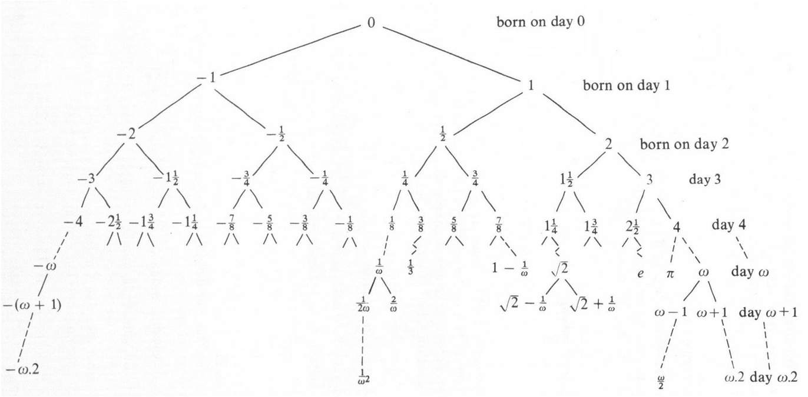

# 序关系与有序域

## 序关系

对于集合 $S$ 及 $S\times S$ 的子集 $R$，若 $R$ 满足

- 自反性：$\forall a\in S,(a,a)\in R$
- 传递性：$(a,b),(b,c)\in R\Rightarrow (a,c)\in R$

则称 $R$ 是 $S$ 上的 **预序关系**，并将 $(a,b)\in R$ 记为 $aRb$。若预序关系 $R$ 还满足

- 反对称性：$(a,b),(b,a)\in R\Leftrightarrow a=b$

则称 $R$ 为 $S$ 上的 **偏序关系**。

可以发现，$S$ 内的所有元素关于预序关系 $R$ 形成了一个有向图，  
其中 $aRb$ 当且仅当从 $a$ 可以直接或间接到达 $b$。

偏序关系的反对称性则将有向图限定为有向无环图。  
因为任意有向图可以通过缩点转化为无向图，相应地，$S$ 上的任意预序关系 $R$ 亦都定义了 $S$ 上的一个等价关系 

$$a\mathop{=}\limits^Rb\Leftrightarrow aRb,aRa$$

且 $R$ 为 $\mathop{=}\limits^R$ 意义下的偏序关系。

此外，若预序关系 $R$ 满足

- 连接性：$\forall a,b\in R,((a,b)\in R)\land((b,a)\in R)$

则称 $R$ 为 $S$ 上的 **弱序关系**。满足连接性的偏序关系被称为 **全序关系**。  
全序关系意味者着 $S$ 中所有元素皆可比较，也就可以排序排成一列，形成一条链。结合传递性和连接性即可推出

- 不可比的传递性：$(a,b),(b,c)\notin R\Rightarrow (a,c)\notin R$

## 有序域

在序关系的基础上，对于域 $(P,+,\times)$，若定义了其上的全序关系 $\le$，其满足

1. $a\le b\Rightarrow a+c\le b+c$
2. $0\le a,0\le b\Rightarrow 0\le a\times b$

则称 $(P,+,\times,\le)$ 为 **有序域**。

有理数域 $\mathbb{Q}$ 是最小的有序域。有序域上可以任意作我们所熟悉的不等式运算。

练习：试用有序域的定义证明

$$
0\le a\Leftrightarrow -a\le 0\\
a\le b,c\le d\Leftrightarrow a+c\le b+d\\
a\le b,0\le c\Rightarrow a\times c\le b\times c\\
a\le b,c\le 0\Rightarrow b\times c\le a\times c\\
0\le c\Leftrightarrow 0\le c^{-1}\\
$$

# 组合博弈

现实中，我们经常会遇到多个不同主体的竞争与对抗，如棋牌、电子游戏等。若一场游戏满足  

- 游戏有两个人参与，二者轮流做出决策，双方均知道游戏的完整信息；
- 游戏中的同一个状态不可能多次抵达，游戏以玩家无法行动为结束，且游戏一定会在有限步后以非平局结束。
- 整场游戏的决策结果是确定的，没有随机因素的影响。

则称该游戏为 **组合游戏** 或 **组合博弈**。  
我们称参与组合博弈的双方为左方和右方，因为双方轮流作出决策，故有先手和后手之分。  
于是，一场组合博弈的结果只可能有四种：左方必胜、右方必胜、先手必胜、后手必胜。

----------------

接下来，我们考虑对组合博弈作出数学上的形式化定义。  
注意到，组合博弈可以抽象为一个有向无环图，其中有些边属于左方，有些边属于右方（表示双方的决策）。  
初始时图上有一个棋子，每回合一方选择一条有向边，将棋子沿该有向边移动到另一个点。  
所在回合没有可选取有向边的一方为输家（赢家的情况可以通过添加点、边转化为输家的情况）。  

因为博弈的过程只与双方的可选决策有关，故定义，组合博弈（以下简称 **博弈**）为一个有序对

$$\{L|R\}$$

其中 $L,R$ 均为博弈组成的集合，分别表示当前状态下左方和右方的决策。  
为保证游戏一定会在有限步后结束（即无环），我们规定只能从已构造的博弈中选取元素组成 $L,R$，  
进而构造一个新博弈 $\{L|R\}$。

可以发现，我们可以以该定义为基础，从一无所知将所有的组合博弈（包括现实中的象棋、围棋）构造出来。  
初始时，我们没有任何博弈，于是无中生有，构造第一个博弈

$$0=\{\varnothing|\varnothing\}$$

有了 $0$ 这第一个博弈，就可以构造更多的博弈

$$1=\{\{0\}|\varnothing\},-1=\{\varnothing|\{0\}\},*=\{\{0\}|\{0\}\}$$

在此基础上继续构造，就可以构造出所有的博弈，乃至无限博弈。  
以上博弈被记为 $0,-1,1,*$ 的原因将在下文给出。

### 博弈的关系

如何判定一场组合博弈的结果？我们定义博弈的一个关系 $\le$：

对于博弈 $x=\{L_x|R_x\},y=\{L_y|R_y\},x\le y$ 当且仅当

$$\forall l_x\in L_x,r_y\in R_y,y\not\le l_x,r_y\not\le x$$

那么对于任意博弈 $g$，其与 $0$ 的关系可以确定博弈的结果：

- $0\le g$ 且 $g\not\le 0$（记为 $g>0$）$\Leftrightarrow$ 左方必胜
- $g\le 0$ 且 $0\not\le g$（记为 $g<0$）$\Leftrightarrow$ 右方必胜
- $g\le 0$ 且 $0\le g$（记为 $g\equiv 0$，称为 **值相等**）$\Leftrightarrow$ 后手必胜
- $g\not\le 0$ 且 $0\not\le g$（记为 $g||0$）$\Leftrightarrow$ 先手必胜

> 证明：设 $g=\{L|R\}$，且 $L,R$ 中所有元素均满足以上性质。  
> $\qquad$ 若 $g>0$，根据 $\le$ 的定义有
> $$\forall r\in R,r\not\le 0,\exists l\in L,0\le l$$
> $\qquad$ 这意味着若左方先手，则左方存在决策使得作出决策后的局面左方必胜或后手必胜；  
> $\qquad$ 若右方先手，则右方无决策（右方立刻落败）或不论作什么决策，作出决策后的局面均为左方必胜或先手必胜。  
> $\qquad$ 由此得到，左方是必胜的。$g<0,g\equiv 0,g||0$ 是类似的。  
> $\qquad$ 易验证待证明的性质对 $0,1,-1,*$ 等几个最初构造的博弈成立，由此归纳得到该性质对所有博弈成立。 
>

此外，$\le$ 还是一个预序关系，即其满足

- 自反性：对于任意博弈 $g$，$g\le g$。
  > 证明：设 $g=\{L|R\}$，且 $L,R$ 中的元素均符合自反性。  
  > $\qquad$ 假设 $g\not\le g$，根据 $\le$ 的定义，这意味着 $\exist l\in L,g\le l$ 或 $\exist r\in R,r\le g$。  
  > $\qquad$ 若 $\exist l\in L,g\le l$，根据 $\le$ 的定义，$\forall l'\in L,l\not\le l'$，又因为 $l\in L$，故推出 $l\not\le l$，产生矛盾。  
  > $\qquad$ 同理，$\exist r\in R,r\le g$ 可推出 $r\not\le r$，亦产生矛盾。  
  > $\qquad$ 空集上的关系显然是满足自反性的，故归纳得 $g\le g$ 对任意博弈 $g$ 均成立。  

  根据自反性，我们可以用 $\le$ 的定义验证，对于任意博弈 $g=\{L|R\}$，有
	$$\forall l\in L,g\not\le l,\forall r\in R,r\not\le g$$
- 传递性：对于任意博弈 $x,y,z$ 有 $x\le y,y\le z\Rightarrow x\le z$。
  > 证明：考虑归纳。若对于任意的 $l_x\in L_x,r_z\in R_z$ 有
  > $$y\le z,z\le l_x\Rightarrow y\le l_x$$
  > $$r_z\le x,x\le y\Rightarrow r_z\le y$$
  > $\qquad$ 那么
  > $$\begin{rcases}\begin{rcases}x\le y\Rightarrow \forall l_x\in L_x,y\not\le l_x\\y\le z\end{rcases}\Rightarrow \forall l_x\in L_x z\not\le l_x\\\begin{rcases}x\le y\\y\le z\Rightarrow\forall r_z\in R_z,r_z\not\le y\end{rcases}\Rightarrow \forall r_z\in R_z,r_z\not\le x\end{rcases}\Rightarrow x\le z$$
  > $\qquad$ 由于递归到最后必有 $L_x=\varnothing$ 和 $R_z=\varnothing$，故传递性对任意 $x,y,z$ 成立。

### 博弈的加法

我们定义两个博弈的 **和博弈** 为：两场博弈同时进行，但一方一个回合内只能选择其中一场作出决策，  
另一场则不作任何操作，胜负的判定仍为无法作出操作者负。即

$$x+y=\{(L_x+y)\cup(x+L_y)|(R_x+y)\cup(x+R_y)\}$$

其中 $L_x+y=\{l_x+y|l_x\in L_x\}$，$x+L_y$ 等是类似的。

我们可以验证，博弈关于博弈的加法 $+$ 构成交换幺半群，即

- 封闭性：两场博弈的和仍是博弈。
- 交换律：归纳得 $x+y=\{(L_x+y)\cup(x+L_y)|(R_x+y)\cup(x+R_y)\}$  
  $=\{(y+L_x)\cup(L_y+x)|(y+R_x)\cup(R_y+x)\}=y+x$。
- 结合律：归纳得 
  $$(x+y)+z=\{((L_x+y)+z)\cup((x+L_y)+z)\cup((x+y)+L_z)|((R_x+y)+z)\cup((x+R_y)+z)\cup((x+y)+R_z)\}$$
  $$=\{(L_x+(y+z))\cup(x+(L_y+z))\cup(x+(y+L_z))|(R_x+(y+z))\cup(x+(R_y+z))\cup(x+(y+R_z))\}=x+(y+z)$$
- 单位元：归纳得 $x+0=\{(L_x+0)\cup(x+\varnothing)|(R_x+0)\cup(x+\varnothing)\}=\{L_x\cup\varnothing|R_x\cup\varnothing\}=x$

并且，博弈的加法 $+$ 与 $\le$ 之间还满足

$$a\le b\Leftrightarrow a+c\le b+c$$

> 证明：考虑归纳。若对于任意的 $l_a\in L_a,r_b\in R_b$ 有
> $$b\le l_a\Leftrightarrow b+c\le l_a+c$$
> $$r_b\le a\Leftrightarrow r_b+c\le a+c$$
> $\qquad$ 那么  
> $$a\le b\Leftrightarrow\begin{Bmatrix}\forall l_a\in L_a,b\not\le l_a\\\forall r_b\in R_b,r_b\not\le a\end{Bmatrix}\Leftrightarrow \begin{Bmatrix}\forall l_a\in L_a,b+c\not\le l_a+c\\\forall r_b\in R_b,r_b+c\not\le a+c\end{Bmatrix}\Leftrightarrow a+c\le b+c$$
> $\qquad$ 由于递归到最后必有 $L_a=\varnothing$ 和 $R_b=\varnothing$，故 $a\le b\Leftrightarrow a+c\le b+c$ 对任意博弈 $a,b,c$ 成立。

我们定义一场博弈的 **反博弈** 为交换左右双方进行博弈，即

$$-\{L|R\}=\{-R|-L\}$$

那么显然可归纳得 $-(-g)=g$。且在 $\equiv$ 意义下，反博弈就是博弈的加法逆元，即对于任意博弈 $g$ 有

$$g+(-g)\equiv 0$$

> 证明：设 $g=\{L|R\}$，那么根据博弈加法的定义有
> $$g+(-g)=\{(L+(-g))\cup(g+(-R))|(R+(-g))\cup(g+(-L))\}$$
> $\qquad\quad$ 若我们已经验证了
> $$\forall l\in L,r\in R,l+(-l)\equiv r+(-r)\equiv 0$$
> $\qquad\quad$ 由 $\le$ 自反性的推论 $\forall l\in L,r\in R,g\not\le l,r\not\le g$ 得
> $$\forall l\in L,g+(-l)\not\le l+(-l)\equiv 0$$ 
> $$\forall r\in R,0\equiv r+(-r)\not\le g+(-r)$$ 
> $\qquad\quad$ 同时根据反博弈的定义 $-g=\{-R|-L\}$ 亦可得
> $$\forall r\in R,r+(-g)\not\le r+(-r)\equiv 0$$ 
> $$\forall l\in L,0\equiv l+(-l)\not\le l+(-g)$$ 
> $\qquad\quad$ 于是可根据 $\le$ 的定义得 $0\le g+(-g)$ 且 $g+(-g)\le 0$，即 $g+(-g)\equiv 0$。

## 公平博弈

若一场博弈的整个过程中，左右双方的决策集合总是相同的，则称该博弈为 **公平博弈**。  
具体地，$g=\{L|R\}$ 为公平博弈当且仅当 $L=R$，且 $L$ 中的元素仍为公平博弈。  

例如，$0=\{\varnothing|\varnothing\},*=\{0|0\}$ 都是公平博弈。

由于公平博弈中左右双方没有区分，博弈的结果只有先手必胜和后手必胜两种，  
且公平博弈的反博弈一定是其本身，即对于任意公平博弈 $g$ 有

$$g=-g$$

### Nim 游戏

Nim 游戏是典型的公平组合游戏。

设有一列 $n$ 堆石子，双方轮流操作，每次一方选择其中一堆，取走其中任意个石子，但不能不取。  
取走最后一颗石子的人获胜，即面对“每一堆石子均被取完”局面的人落败。

> 求证：设 $n$ 堆石子所含的石子数分别为 $a_1,a_2,\cdots,a_n$，则 Nim 游戏后手必胜当且仅当
> $$a_1\operatorname{xor}a_2\operatorname{xor}\cdots\operatorname{xor}a_n=0$$
> 证明：若 $a_1=a_2=\cdots=a_n=0$，显然 $a_1\operatorname{xor}a_2\operatorname{xor}\cdots\operatorname{xor}a_n=0$，且先手必败，即后手必胜。否则，  
> $\qquad 1^\circ$ 若 $a_1\operatorname{xor}a_2\operatorname{xor}\cdots\operatorname{xor}a_n=0$，设先手选择了第 $k$ 堆石子，取完之后第 $k$ 堆还剩 $a_k'$ 个石子，  
> $\qquad\quad$ 那必然有 $a'_k\not =a_k$，即 $a_k\operatorname{xor}a_k'\not =0$。因此
> $$a_1\operatorname{xor}a_2\operatorname{xor}\cdots\operatorname{xor}a_k'\operatorname{xor}\cdots\operatorname{xor}a_n=(a_1\operatorname{xor}a_2\operatorname{xor}\cdots\operatorname{xor}a_k\operatorname{xor}\cdots\operatorname{xor}a_n)\operatorname{xor}a_k\operatorname{xor}a_k'$$
> $$=0\operatorname{xor}a_k\operatorname{xor}a_k'=a_k\operatorname{xor}a_k'\not=0$$
> $\qquad\quad$ 即，不论先手如何决策，下一个局面必然为 $a_1\operatorname{xor}a_2\operatorname{xor}\cdots\operatorname{xor}a_n\not=0$ 的局面，即先手必胜局面。   
> $\qquad 2^\circ$ 若 $a_1\operatorname{xor}a_2\operatorname{xor}\cdots\operatorname{xor}a_n=s\not=0$，设 $s$ 的最高位为第 $m$ 位，  
> $\qquad\quad$ 那必然存在 $k\in\{1,2,\cdots,n\}$ 使得 $a_k$ 的第 $m$ 位非 $0$。此时
> $$a_k\operatorname{xor}s<a_k$$
> $\qquad\quad$ 于是先手必然可以选择第 $k$ 堆石子，取走其中 $a_k-(a_k\operatorname{xor}s)$ 个石子，  
> $\qquad\quad$ 从而使下一个局面为 $a_1\operatorname{xor}a_2\operatorname{xor}\cdots\operatorname{xor}a_n=0$ 的局面，即后手必胜局面。  
> $\qquad$ 综上，Nim 游戏后手必胜当且仅当 $a_1\operatorname{xor}a_2\operatorname{xor}\cdots\operatorname{xor}a_n=0$ 。

这样以来，我们就解决了 Nim 游戏的结果判定问题。

### Nimber

注意到，Nim 游戏实质上是只有若干个只有一堆石子的 Nim 游戏的和博弈。  
这意味着 Nim 游戏关于博弈的加法蕴含着简单而优美的性质。

具体地，我们称只有一堆 $n$ 个石子的 Nim 游戏为 **Nimber**，记为 $*_n$。即

$$*_n=\{\{*_0,*_1,\cdots,*_{n-1}\}|\{*_0,*_1,\cdots,*_{n-1}\}\}$$

显然有 $*_0=0,*_1=*$，且 $\forall n\in\N_+,*_n||0$。对于 Nimber 的和博弈，我们有

> **Sprague–Grundy 定理（SG 定理）**：$*_n+*_m\equiv *_{n\operatorname{xor}m}$  
> 证明：对于有三堆石子，且三堆石子个数依次为 $n,m,n\operatorname{xor}m$ 的 Nim 游戏，由于
> $$n\operatorname{xor} m\operatorname{xor}(n\operatorname{xor}m)=0$$
> $\qquad\quad$ 其一定是后手必胜的，即
> $$*_n+*_m+*_{n\operatorname{xor}m}\equiv 0$$
> $\qquad\quad$ 因为公平博弈的反博弈为其本身，故
> $$*_n+*_m\equiv *_{n\operatorname{xor}m}$$

### SG 函数

Nim 游戏的结论能否推广到一般的公平博弈中呢？  
对于 $S\subseteq\N$，定义 $\operatorname{mex} S$ 为 $S$ 中未出现的最小自然数，如

$$\operatorname{mex}\{0,1,3\}=2$$

对于有限公平博弈 $g=\{S|S\}$，定义 **SG 函数**

$$SG(g)=\operatorname{mex}\{SG(a)|a\in S\}$$

则

$$g\equiv *_{SG(g)}$$

> 证明：设 $SG(g)=n$，相当于证明 $g+*_n\equiv 0$，即 $g+*_n$ 是后手必胜的。  
> $\qquad$ 考虑归纳，设 $\forall a\in S,a\equiv *_{SG(a)}$。考虑 $g+*_n$ 中先手的所有决策，  
> $\qquad 1^\circ$ 若先手先操作 $*_n$，使得 $*_n$ 变为了 $*_m\ (m<n)$。根据 $\operatorname{mex}$ 的定义，  
> $\qquad\quad$ 必然存在 $a\in S$ 使得 $SG(a)=m$，即后手接下来可以通过操作 $g$ 使得 $g$ 变为 $a$，  
> $\qquad\quad$ 使得先手下一步要面对局面 $a+*_m$，因为 $a+*_m\equiv 0$，这是一个后手必胜的局面。  
> $\qquad 2^\circ$ 若先手先操作 $g$，使得 $g$ 变为 $a$，根据 $\operatorname{mex}$ 的定义，$SG(a)\not=n$，故根据 SG 定理有
> $$a+*_n\equiv *_{SG(a)}+*_n\equiv *_{SG(a)\operatorname{xor} n}||0$$
> $\qquad\quad$ 即，后手接下来要面对的局面 $a+*_n$ 是一个先手必胜的局面。  
> $\qquad$ 综上，不论先手如何操作，后手接下来必然面对一个先手必胜的局面，故 $g+*_n$ 是后手必胜的。

这样一来，任意有限公平博弈均可规约为 Nimber，进而用 SG 定理解决和博弈问题。无限的公平博弈是类似的。

## 不公平博弈和超现实数

对于博弈 $g=\{L|R\}$，$g$ 为 **超现实数** 当且仅当 $L,R$ 中的元素都是超现实数，且

$$\forall l\in L,r\in R,r\not\le l$$

显然 $0=\{\varnothing|\varnothing\},1=\{0|\},-1=\{|0\}$ 都是超现实数。

作为一种特殊的博弈，超现实数满足的性质比一般的博弈要丰富不少。  
首先，对于超现实数 $g=\{L|R\}$，我们有

$$\forall l\in L,r\in R,l<g\texttt{ 且 }g<r$$

> 证明：考虑归纳。设
> $$\forall l_l\in L_l,l_l\le l$$
> $\qquad\quad$ 我们已经由 $\le$ 的自反性得到 $g\not\le l$，故由 $\le$ 的传递性得 
> $$\forall l_l\in L_l,g\not\le l_l$$
> $\qquad\quad$ 将其与超现实数的定义 $\forall r\in R,r\not\le l$ 结合，即可由 $\le$ 的定义得
> $$l=\{L_l|R_l\}\le g=\{L|R\}$$
> $\qquad\quad$ 同理可得 $g\le r,r\not\le g$。因此 $l<g$ 且 $g<r$ 。

在此基础上，即可证明 $\le$ 对于超现实数满足连接性，即对于任意数 $x,y$，$x\le y$ 和 $y\le x$ 至少有一个成立。

> 证明：若 $x\not\le y$，根据 $\le$ 的定义得存在 $l_x\in L_x,y\le l_x$ 或存在 $r_y\in R_y,r_y\le y$  
> $\qquad$ 由于 $\forall l_x\in L_x,l_x\le x$ 且 $\forall r_y\in R_y,y\le r_y$，根据 $\le$ 的传递性即可推出 $y\le x$。  
> $\qquad$ 同理，$y\not\le x$ 也可推出 $x\le y$，故 $\le$ 关于超现实数的连接性成立。  

而对于博弈的加法，则显然可归纳得，任意一个超现实数的反博弈（相反数）仍是超现实数，  
且可以证明，超现实数关于博弈的加法满足封闭性。

> 证明：考虑归纳。若我们已经证明了 $\forall l_x\in L_x,r_x\in R_x,l_y\in L_y,r_y\in R_y$，  
> $\qquad\quad l_x+y,r_x+y,x+l_y,x+r_y$ 均为超现实数，那么   
> $\qquad\quad L_x+y,x+L_y,R_y+x,x+R_y$ 均为超现实数构成的集合。  
> $\qquad\quad$ 因为 $l_x<x,x<r_x,l_y<y,y<r_y$，故由博弈加法的性质得
> $$l_x+y,x+l_y<x+y\texttt{ 且 }x+y<r_x+y,x+r_y$$
> $\qquad\quad$ 由 $\le$ 的传递性和关于超现实数的连接性，即可推出 $\le$ 关于超现实数满足不可比的传递性。于是   
> $$r_x+y,x+r_y\not\le l_x+y,x+l_y$$
> $\qquad\quad$ 因此由超现实数的定义，
> $$x+y=\{(L_x+y)\cup(x+L_y)|(R_x+y)\cup(x+R_y)\}$$
> $\qquad\quad$ 也是超现实数。由于递归到最后必有 $L_x=R_x=L_y=R_y=\varnothing$，  
> $\qquad\quad$ 故归纳得任意两个超现实数的和仍是超现实数。

### 超现实数的结构

超现实数之所以被称为“数”，是因为其内部有着与我们所熟知的实数完全等价的结构。

首先，我们可以在有限步内构造出任意自然数

$$
\{\{0\}|\varnothing\}=1,\{\{1\}|\varnothing\}=2,\{\{2\}|\varnothing\}=3,\cdots\\
$$

易归纳得，对超现实数形式的任意自然数 $x$，有

$$x+1=\{\{x\}|\}$$

也就是说，这与皮亚诺公理定义的自然数和自然数加法等效。

根据反博弈的定义，负整数也能在有限步内构造出来

$$\{\varnothing|\{0\}\}=-1,\{\varnothing|\{-1\}\}=-2,\{\varnothing|\{-2\}\}=-3,\cdots$$

此外，任意二进制有限小数都能在有限步内被构造出来，例如

$$\{\{1\}|\{2\}\}=,\left\{\{2\}|\left\{\dfrac{3}{2}\right\}\right\}=\dfrac{7}{4}$$

在构造出所有二进制有限小数后，即可用无限的集合，通过逼近的方法构造出任意实数。如

$$\dfrac{1}{3}=\left\{\left\{0,\dfrac{1}{4},\dfrac{5}{16},\dfrac{21}{64},\cdots\right\}|\left\{1,\dfrac{1}{2},\dfrac{3}{8},\dfrac{11}{32},\cdots\right\}\right\}$$

这样构造博弈的操作是合法的：无限多个点的图依然可以是有向无环图。

与实数一同构造出来的，还有无穷大和无穷小

$$\omega=\{\{0,1,2,3,\cdots\}|\},\epsilon=\left\{0|\left\{1,\dfrac{1}{2},\dfrac{1}{4},\cdots\right\}\right\}$$

易验证，$\omega$ 和 $\epsilon$ 都是合法的超现实数，且 $\omega$ 大于任意自然数，而 $\epsilon$ 比 $0$ 大，比任意正实数小。

$\omega,\epsilon$ 依然不是最大的超现实数或最小的正超现实数。例如

$$\omega+1=\{\{\omega\}|\}$$

也是超现实数，且比 $\omega$ 大。

综上，超现实数的构造过程如下图所示，形成了一棵 bfs 树。

我们注意到，在构造超现实数的过程中，有些数被多次重复构造了出来，即值与已经构造出来的数相等。如

$$\{-1|1\}\equiv 0$$

我们希望避免重复的构造，即对于任意超现实数找到与其值相等的最简单的数。

> 求证：对于超现实数 $x$，若存在超现实数 $y$ 使得
> $$\forall l_x\in L_x,l_x<y,\forall r_x\in R_x,y<r_x$$
> $\qquad\quad$ 且不存在 $z\in L_y\cup R_y$ 使得
> $$\forall l_x\in L_x,l_x<z,\forall r_x\in R_x,z<r_x$$
> $\qquad\quad$ 则 $x\equiv y$。  
> 证明：因为 $\forall l_x\in L_x,l_x<y,\forall r_y\in R_y,y<r_y$，故
> $$\forall l_x\in L_x,r_y\in R_y,l_x<r_y$$
> $\qquad\quad$ 又因为不存在 $r_y\in R_y$ 使得
> $$\forall l_x\in L_x,l_x<r_y,\forall r_x\in R_x,r_y<r_x$$
> $\qquad\quad$ 故 $\forall r_y\in R_y,\exist r_x\in R_x,r_x\le r_y$。又因为 $\forall r_x\in R_x,x<r_x$，故
> $$\forall r_y\in R_y,x<r_y$$
> $\qquad\quad$ 将其与 $\forall l_x\in L_x,l_x<y$ 结合，根据 $\le$ 的定义，即可得
> $$x\le y$$
> $\qquad\quad$ 同理可证明 $y\le x$。故 $x\equiv y$。

以上结论自然引出了以下一条重要的法则：

> **简单性法则**：对于超现实数 $x=\{L|R\}$，若我们在 bfs 树上找到了超现实数 $y$ 使得
> $$\forall l_x\in L_x,l_x<y,\forall r_y\in R_y,y<r_x$$
> $\qquad\quad$ 且 $y$ 是所有满足要求的数中 bfs 序最小的，则 $x\equiv y$。  
> 这是显然的。bfs 序最小必然意味着不存在 $z\in L_y\cup R_y$ 使得
> $$\forall l_x\in L_x,l_x<z,\forall r_x\in R_x,z<r_x$$

### 博弈的乘法

我们定义两个博弈的 **积博弈**

$$xy=\{(L_xy+xL_y-L_xL_y)\cup(R_xy+xR_y-R_xR_y)|(L_xy+xR_y-L_xR_y)\cup(R_xy+xL_y-R_xL_y)\}$$
