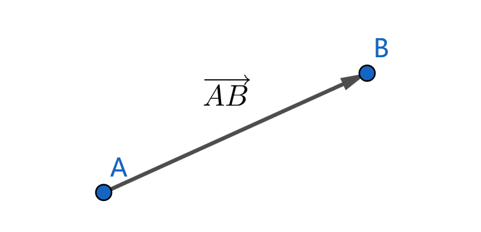
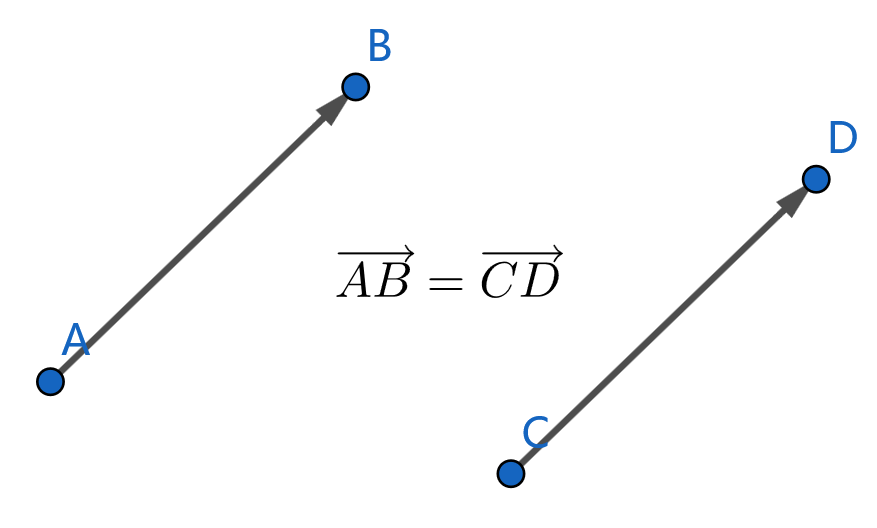
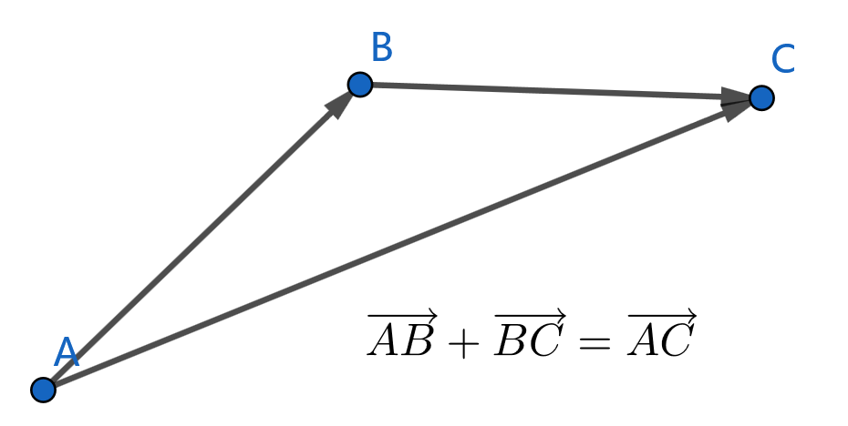
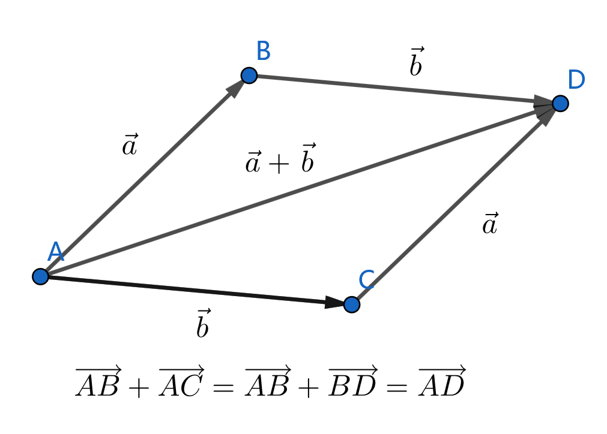
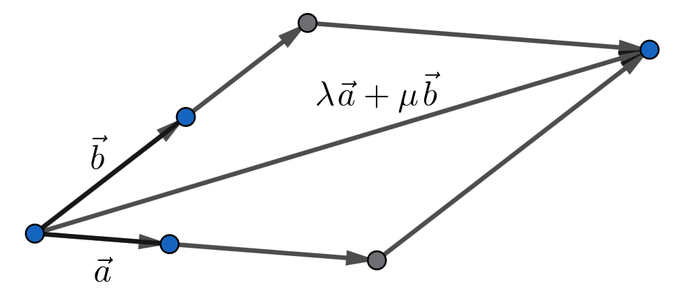
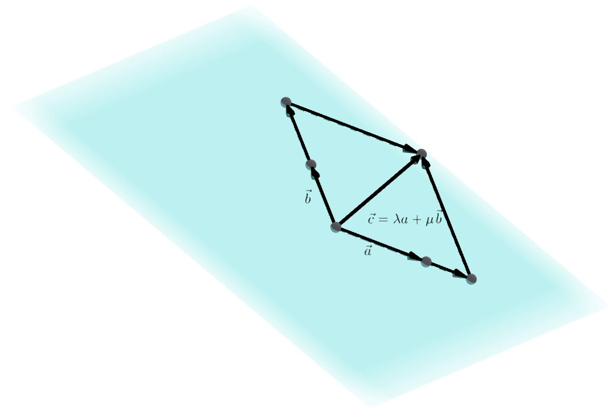
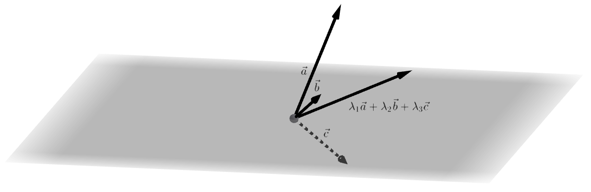
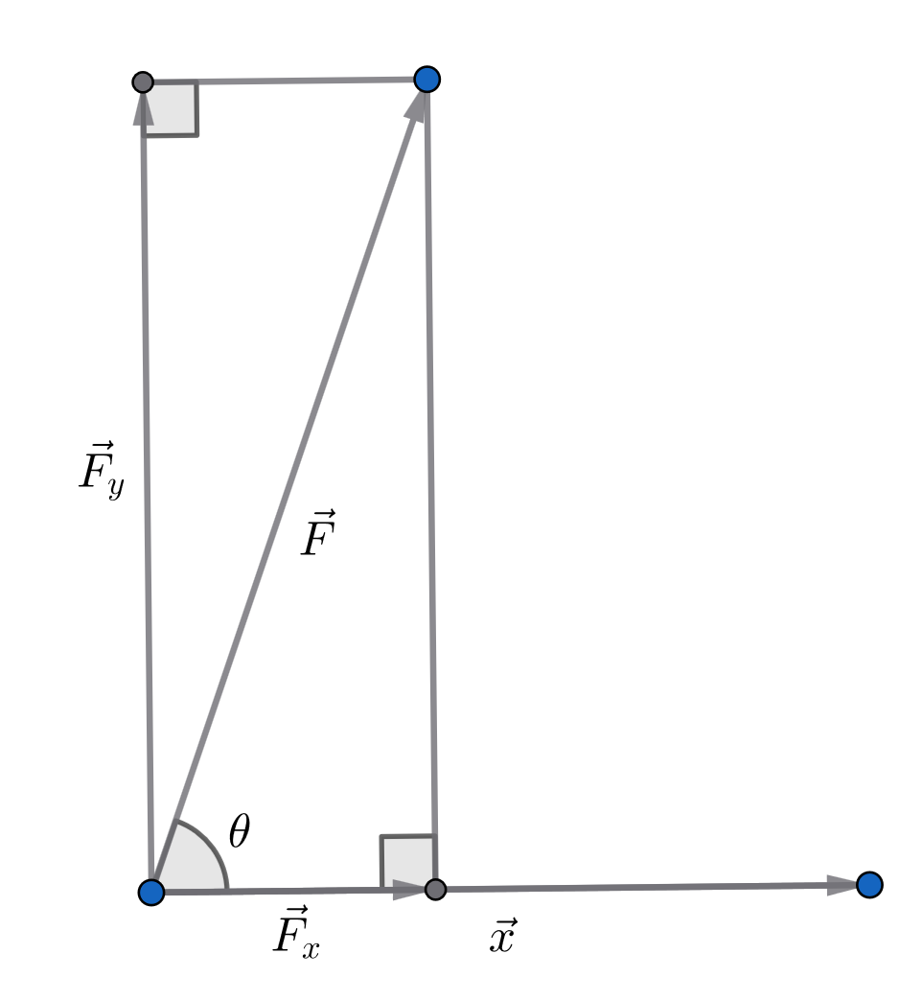

# 欧几里得空间向量

在 $n$ 维欧几里得空间 $\R^n$ 中，我们称既有大小也有方向的量为 **$n$ 维向量**，  
其几何上可以用有向线段来表示，代数上则通过箭头 $\vec{a}$ 或粗体 $\textbf{a}$ 表示。

欧几里得空间向量具有 **平移不变性**，也就是说，两个向量只要平移之后重合便是相等的，  
向量只与起点和终点的相对位置有关，与绝对位置无关。

因此对于向量而言，**平行** 和 **共线** 是两个相同的概念，均记为 $\vec{a}/\!/\vec{b}$。

表示欧几里得空间向量的有向线段的长度称为向量的 **模长**，记为 $|\vec{a}|$。

## 线性运算

欧几里得空间向量的加法遵循 **三角形法则**：通过平移使两个向量首尾相连后，有

$$\overrightarrow{AB}+\overrightarrow{BC}=\overrightarrow{AC}$$

显然由三角形法则可知，向量加法满足结合律，即

$$(\overrightarrow{AB}+\overrightarrow{BC})+\overrightarrow{CD}=\overrightarrow{AB}+(\overrightarrow{BC}+\overrightarrow{CD})=\overrightarrow{AD}$$

且向量加法满足三角形不等式

$$|\overrightarrow{AC}|\le |\overrightarrow{AB}|+|\overrightarrow{BC}|$$

在三角形法则的基础上，还可证明欧几里得空间向量加法的 **平行四边形法则**：  
在平行四边形 $ABCD$ 中，有

$$\overrightarrow{AB}+\overrightarrow{AC}=\overrightarrow{AD}$$

显然，通过平行四边形法则易知向量加法也满足交换律，即

$$\vec{a}+\vec{b}=\overrightarrow{AB}+\overrightarrow{BD}=\overrightarrow{AD}=\overrightarrow{AC}+\overrightarrow{CD}=\vec{b}+\vec{a}$$

接下来引入欧几里得空间向量加法的单位元和逆元。定义 **零向量** $\vec{0}$ 为模长为零，  
起点与终点重合的向量，则零向量就是向量加法的单位元，即

$$\vec{0}+\vec{a}=\vec{a}+\vec{0}=0$$

定义 **相反向量** 为与原向量模长相同，方向相反的向量。即

$$-\overrightarrow{AB}=\overrightarrow{BA}$$

则相反向量是向量加法的逆元，即

$$\overrightarrow{AB}-\overrightarrow{AB}=\overrightarrow{AB}+\overrightarrow{BA}=\overrightarrow{AA}=\vec{0}$$

-------------------------------------

对于欧几里得空间向量 $\vec{a}$，其 **数乘** $\lambda\vec{a}\ (\lambda\in\R)$ 就是其方向不变，模长乘以 $\lambda$ 倍，即

$$|\lambda \vec{a}|=|\lambda||\vec{a}|$$

特别地，当 $\lambda=0$ 时，模长为 $0$，$\lambda\vec{a}=\vec{0}$；
当 $\lambda<0$ 时，$\lambda\vec{a}$ 的方向与原向量方向相反

$$-(\lambda\vec{a})=(-\lambda)\vec{a}$$

显然，欧几里得空间向量的数乘满足

- 与实数乘法的相容性：$(\lambda\mu)\vec{a}=\lambda(\mu\vec{a})=\lambda\mu\vec{a}$
- 关于实数加法的分配律：$(\lambda+\mu)\vec{a}=\lambda\vec{a}+\mu\vec{a}$
- 关于向量加法的分配律：$\lambda(\vec{a}+\vec{b})=\lambda\vec{a}+\lambda\vec{b}$

--------------------------------------------

向量的加法和数乘统称为 **向量的线性运算**。线性运算满足什么自有性质呢？

线性运算与空间的 **维数** 关系密切，具体地，我们有

1. 两向量共线的充要条件：两个非零向量 $\vec{a},\vec{b}$ 共线的充要条件是存在实数 $\lambda$ 使得 $\lambda\vec{a}=\vec{b}$
2. 平面向量基本定理：给定平面中任意两个不共线的非零向量 $\vec{a},\vec{b}$，  
   则平面中任意向量均能唯一表示成
   $$\lambda\vec{a}+\mu\vec{b}\quad(\lambda,\mu\in\R)$$
   的形式。
   
3. 三向量共面的充要条件：任意两个非零向量一定共面。  
   三个非零向量 $\vec{a},\vec{b},\vec{c}$ 共面的充要条件是存在实数 $\lambda,\mu$ 使得
   $$\vec{c}=\lambda\vec{a}+\mu\vec{b}$$
   
4. 空间向量基本定理：给定三维空间中任意三个不共面的非零向量 $\vec{a},\vec{b},\vec{c}$，  
   则空间中任意向量均能唯一表示成
   $$\lambda_1\vec{a}+\lambda_2\vec{b}+\lambda_3\vec{c}\quad(\lambda_1,\lambda_2,\lambda_3\in\R)$$
   的形式。
   

综合以上定理，可以得到

> **欧几里得空间向量基本定理**：$n$ 维空间中 $n$ 个向量 $\vec{a}_1,\vec{a}_2,\cdots,\vec{a}_n$ 不共 $n-1$ 维空间的充要条件为
> $$\forall\lambda_1,\lambda_2,\cdots,\lambda_n\in\R\texttt{ 不同时为}0,\lambda_1\vec{a}+\lambda_2\vec{a}_2+\cdots+\lambda_n\vec{a}_n\not=0$$
> $\qquad$ 给定 $n$ 维空间中 $n$ 个不共 $n-1$ 维空间的向量 $\vec{a}_1,\vec{a}_2,\cdots,\vec{a}_n$，  
> $\qquad$ 则空间中任意向量均能唯一表示成
> $$\lambda_1\vec{a}+\lambda_2\vec{a}_2+\cdots+\lambda_n\vec{a}_n\quad(\lambda_1,\lambda_2,\cdots,\lambda_n\in\R)$$

## 内积

已知某物体在力 $\vec{F}$ 的作用下发生了位移 $\vec{x}$，欲求力 $\vec{F}$ 在位移 $\vec{x}$ 中所做的功。

显然，将力分解为平行于 $\vec{x}$ 和垂直于 $\vec{x}$ 的两个分量 $\vec{F}_x,\vec{F}_y$，  
则 $\vec{F}$ 所做的功就是 $\vec{F}_x$ 的大小与位移 $\vec{x}$ 的长度之积，即

$$|\vec{F}_x||\vec{x}|=|\vec{F}||\vec{x}|\cos\theta$$

由此定义，在欧几里得空间中，设向量 $\vec{a},\vec{b}$ 的夹角为 $\left<\vec{a},\vec{b}\right>$，则定义两个向量的 **内积** 

$$\vec{a}\cdot\vec{b}=|\vec{a}||\vec{b}|\left<\vec{a},\vec{b}\right>$$

显然，欧几里得空间中向量的内积满足

- 对称性：$\vec{a}\cdot\vec{b}=\vec{b}\cdot\vec{a}\ \left(\left<\vec{a},\vec{b}\right>=\left<\vec{b},\vec{a}\right>\right)$
- 线性：$(\vec{a}+\vec{b})\cdot\vec{x}=|(\vec{a}+\vec{b})_x||\vec{x}|=(|\vec{a}_x|+|\vec{b}_x|)|\vec{x}|=\vec{a}\cdot\vec{x}+\vec{b}\cdot\vec{x}$  
  $\qquad\ (\lambda\vec{a})\cdot\vec{b}=\vec{a}\cdot(\lambda\vec{b})=\lambda(\vec{a}\cdot\vec{b})$
- 正定性：$\vec{a}\cdot\vec{a}=\vec{a}^2=|\vec{a}|^2\ge 0$，当且仅当 $\vec{a}=\vec{0}$ 时取等号。

## 叉积

在阅读该小节前请阅读完`【模】（5）行列式与秩`。

行列式给出了 $n$ 维空间的 $n$ 维有向体积。我们希望将其扩充，得到 $n$ 维空间的 $m$ 维有向体积。 

> 求证：对于 $m$ 行 $n$ 列矩阵 $A$，其 $n$ 个列向量所张成的 $n$ 维体积的大小为
> $$\sqrt{|A^TA|}$$
> 证明：设 $A=\left[\begin{array}{c|c|c|c}\vec{a}_1&\vec{a}_2&\cdots&\vec{a}_n\end{array}\right],B=A^TA$，则
> $$B_{i,j}=\vec{a}_i\cdot\vec{a}_j$$
> $\quad\vec{a}_1,\vec{a}_2,\cdots,\vec{a}_n$ 线性相关时，因为
> $$A\vec{x}=\vec{0}\Rightarrow A^TA\vec{x}=\vec{0}$$
> $\quad$ 故 $B$ 的列向量也是线性相关的，即 $|B|=0$，与 $\vec{a}_1,\vec{a}_2,\cdots,\vec{a}_n$ 张成的 $n$ 维体积大小为 $0$ 相符合。   
> $\quad$ 于是只需要证明 $\vec{a}_1,\vec{a}_2,\cdots,\vec{a}_n$ 线性无关时，$\sqrt{|B|}>0$ 为 $\vec{a}_1,\vec{a}_2,\cdots,\vec{a}_n$ 张成的 $n$ 维体积大小即可。  
> $\quad$ 考虑归纳，易发现计算 $\vec{a}_1,\vec{a}_2,\cdots,\vec{a}_n$ 所张成的体积大小的过程可分以下两步递归实现：  
> 1. 提取出 $\vec{a}_n$ 与 $\vec{a}_1,\vec{a}_2,\cdots,\vec{a}_{n-1}$ 垂直的分量 $\vec{a}'_n$。具体地，需要求解 $\lambda_1,\lambda_2,\cdots,\lambda_{n-1}$，使得
>    $$\begin{cases}\vec{a}'_n=\lambda_1\vec{a}_1+\lambda_2\vec{a}_2+\cdots+\lambda_{n-1}\vec{a}_{n-1}+\vec{a}_n\\\vec{a}_1\cdot\vec{a}'_n=\vec{a}_2\cdot\vec{a}'_n=\cdots=\vec{a}_{n-1}\cdot\vec{a}'_n=0\end{cases}$$
>    也就是说
>    $$\begin{bmatrix}\vec{a}_1^T\\\hline\vec{a}_2^{T^{^{^{}}}}\\\hline\vdots\\\hline\vec{a}_{n-1}^{T^{^{^{}}}}\end{bmatrix}\left(\left[\begin{array}{c|c|c|c}\vec{a}_1&\vec{a}_2&\cdots&\vec{a}_{n-1}\end{array}\right]\begin{bmatrix}\lambda_1\\\lambda_2\\\vdots\\\lambda_{n-1}\end{bmatrix}+\vec{a}_n\right)=\vec{0}$$
>    $$\begin{bmatrix}\vec{a}_1^T\\\hline\vec{a}_2^{T^{^{^{}}}}\\\hline\vdots\\\hline\vec{a}_{n-1}^{T^{^{^{}}}}\end{bmatrix}\left[\begin{array}{c|c|c|c}\vec{a}_1&\vec{a}_2&\cdots&\vec{a}_{n-1}\end{array}\right]\begin{bmatrix}\lambda_1\\\lambda_2\\\vdots\\\lambda_{n-1}\end{bmatrix}=-\begin{bmatrix}\vec{a}_1^T\\\hline\vec{a}_2^{T^{^{^{}}}}\\\hline\vdots\\\hline\vec{a}_{n-1}^{T^{^{^{}}}}\end{bmatrix}\vec{a}_n\qquad(1)$$
>    求解以上线性方程组即可得到一组可行的 $\lambda_1,\lambda_2,\cdots,\lambda_{n-1}$。
> 2. 计算 $\vec{a}_1,\vec{a}_2,\cdots,\vec{a}_{n-1}$ 所张成的 $n-1$ 维体积的大小（设为 $S$）。  
>    那么，$\vec{a}_1,\vec{a}_2,\cdots,\vec{a}_n$ 所张成的 $n$ 维体积的大小为 $|\vec{a}_n'|S$。
>
> $\quad$ 可以发现，对于第 1. 步，因为 $\vec{a}_1,\vec{a}_2,\cdots,\vec{a}_{n-1}$ 线性无关，它们张成的 $n-1$ 维体积
> $$S=\sqrt{\left|\begin{bmatrix}\vec{a}_1^T\\\hline\vec{a}_2^{T^{^{^{}}}}\\\hline\vdots\\\hline\vec{a}_{n-1}^{T^{^{^{}}}}\end{bmatrix}\left[\begin{array}{c|c|c|c}\vec{a}_1&\vec{a}_2&\cdots&\vec{a}_{n-1}\end{array}\right]\right|}>0$$
> $\quad$ 故方程组 $(1)$ 有唯一解，此时将 $\vec{a}_n$ 替换成 $\vec{a}'_n$ 的过程对应于不断对矩阵 $B$ 作如下初等变换：  
> 1. 将第 $n$ 行加上第 $i$ 行的 $\lambda_i$ 倍。
> 2. 将第 $n$ 列加上第 $i$ 列的 $\lambda_i$ 倍。
> 
> $\quad$ 对于第 2. 步，显然经过第 1. 步的初等变换后有 
> $$B=\left[\begin{array}{c|c}\begin{bmatrix}\vec{a}_1^T\\\hline\vec{a}_2^{T^{^{^{}}}}\\\hline\vdots\\\hline\vec{a}_{n-1}^{T^{^{^{}}}}\end{bmatrix}\left[\begin{array}{c|c|c|c}\vec{a}_1&\vec{a}_2&\cdots&\vec{a}_{n-1}\end{array}\right]&\vec{0}\\\hline\vec{0}^T&\vec{a}'_n\cdot\vec{a}'_n\end{array}\right]$$
> $\quad$ 由于 $\vec{a}_1,\vec{a}_2,\cdots,\vec{a}_n$ 线性无关，故 $\vec{a}'_n\not =0$，于是
> $$\sqrt{|B|}=\sqrt{(\vec{a}'_n\cdot\vec{a}'_n)\left|\begin{bmatrix}\vec{a}_1^T\\\hline\vec{a}_2^{T^{^{^{}}}}\\\hline\vdots\\\hline\vec{a}_{n-1}^{T^{^{^{}}}}\end{bmatrix}\left[\begin{array}{c|c|c|c}\vec{a}_1&\vec{a}_2&\cdots&\vec{a}_{n-1}\end{array}\right]\right|}=\sqrt{|\vec{a}'_n|^2S^2}=|\vec{a}_n'|S>0$$

以上引理确定了 $n$ 维空间中 $m$ 维有向体积的大小，但并未确定其方向。   
对于 $n$ 维空间的 $n$ 维有向体积而言，一个正负号就足以确定其方向，  
但 $m$ 维有向体积则并非如此。例如，三维空间中的平面需要与之垂直的向量（即法向量）来定向。

> 求证：我们定义，保留矩阵 $A$ 的任意 $k$ 行 $k$ 列，得到的 $k$ 阶方阵的行列式称为矩阵 $A$ 的一个 **$k$ 阶子式**。   
> $\qquad$ 则对于 $n$ 行 $m$ 列矩阵 $A$，$|A^TA|$ 就是 $A$ 的 $\dbinom{n}{m}$ 个 $m$ 阶子式的平方和，即
> $$|A^TA|=\sum_{1\le c_1<c_2<\cdots<c_m\le n}\left(\sum_{m\texttt{元排列}p}(-1)^{\tau(p)}\prod_{k=1}^nA_{k,c_{p_k}}\right)^2$$
> 证明：注意到，对于两个 $n$ 行 $m$ 列矩阵 $A,B$，$|A^TB|$ 具有与内积 $\vec{u}\cdot\vec{v}$ 相似的性质：
> 1. 若 $m=1$，$|A^TB|$ 退化为内积 $\vec{u}^T\vec{v}=\vec{u}\cdot \vec{v}$
> 2. 交换律：$|A^TB|=|(A^TB)^T|=|B^TA|$
> 3. 若 $C$ 为 $m$ 阶方阵，则 $|A^TBC|=|CA^TB|=|C||A^TB|$  
>    其为内积与数乘的相容性的推广。它的一个推论是若对 $A$ 或 $B$ 作初等列变换，$|A^TB|$ 不改变。
> 4. 设 $B=\left[\begin{array}{c|c|c|c}\vec{b}_1&\vec{b}_2&\cdots&\vec{b}_m\end{array}\right]$，则
>    $$\left|A^T\left[\begin{array}{c|c|c|c|c|c}\vec{b}_1&\cdots&\vec{b}_{k-1}&(\vec{b}_k+\vec{u})&\cdots&\vec{b}_m\end{array}\right]\right|=\left|A^TB\right|+\left|A^T\left[\begin{array}{c|c|c|c|c|c}\vec{b}_1&\cdots&\vec{b}_{k-1}&\vec{u}&\cdots&\vec{b}_m\end{array}\right]\right|$$
>    其为内积关于向量加法的的分配律的推广。
> 
> $\quad$ 于是设 $n$ 行 $m$ 列矩阵 $A$ 的列空间各维度的单位向量为 $\vec{e}_1,\vec{e}_2,\cdots,\vec{e}_n$，  
> $\quad$ 我们可以仿照行列式公式展开 $|A^TA|$
> $$|A^TA|=\sum_{p_1,p_2,\cdots,p_m\in[1,n]\cap\N}\left|A^T\left[\begin{array}{c|c|c|c}A_{1,p_1}\vec{e}_{p_1}&A_{2,p_2}\vec{e}_{p_2}&\cdots&A_{m,p_m}\vec{e}_{p_m}\end{array}\right]\right|$$
> $$=\sum_{\substack{p_1,p_2,\cdots,p_m\in[1,n]\cap\N\\q_1,q_2,\cdots,q_m\in[1,n]\cap\N}}\left|\left[\begin{array}{c|c|c|c}A_{1,q_1}\vec{e}_{q_1}&A_{2,q_2}\vec{e}_{q_2}&\cdots&A_{m,q_m}\vec{e}_{q_m}\end{array}\right]^T\left[\begin{array}{c|c|c|c}A_{1,p_1}\vec{e}_{p_1}&A_{2,p_2}\vec{e}_{p_2}&\cdots&A_{m,p_m}\vec{e}_{p_m}\end{array}\right]\right|$$
> $$=\sum_{\substack{p_1,p_2,\cdots,p_m\in[1,n]\cap\N\\q_1,q_2,\cdots,q_m\in[1,n]\cap\N}}\left|\left[\begin{array}{c|c|c|c}\vec{e}_{q_1}&\vec{e}_{q_2}&\cdots&\vec{e}_{q_m}\end{array}\right]^T\left[\begin{array}{c|c|c|c}\vec{e}_{p_1}&\vec{e}_{p_2}&\cdots&\vec{e}_{p_m}\end{array}\right]\right|\prod_{k=1}^mA_{k,p_k}A_{k,q_k}$$
> $\quad$ 之后通过冒泡排序对序列 $p_1,p_2,\cdots,p_m$ 和序列 $q_1,q_2,\cdots,q_m$ 排序。又注意到 
> $$(\left[\begin{array}{c|c|c|c}\vec{e}_{q_1}&\vec{e}_{q_2}&\cdots&\vec{e}_{q_m}\end{array}\right]^T\left[\begin{array}{c|c|c|c}\vec{e}_{p_1}&\vec{e}_{p_2}&\cdots&\vec{e}_{p_m}\end{array}\right])_{i,j}=\vec{e}_{q_i}\cdot\vec{e}_{p_j}=[q_i=p_j]\quad(1)$$
> $\quad$ 若序列 $p_1,p_2,\cdots,p_m$ 中存在重复的元素，那就会导致 $(2)$ 中矩阵存在重复的列，行列式为 $0$；  
> $\quad$ 若 $p_k\notin\{q_1,q_2,\cdots,q_m\}$，那就会导致 $(2)$ 中矩阵的第 $k$ 行全 $0$，行列式为 $0$。  
> $\quad$ 序列 $q_1,q_2,\cdots,q_m$ 同理。因此，若要让 $(2)$ 中矩阵的行列式非零，需要保证  
> $$|\{p_1,p_2,\cdots,p_m\}|=m,\{p_1,p_2,\cdots,p_m\}=\{q_1,q_2,\cdots,q_m\}$$
> $\quad$ 故
> $$|A^TA|=\sum_{1\le c_1<c_2<\cdots<c_m\le n}\sum_{m\texttt{元排列}p,q}(-1)^{\tau(p)+\tau(q)}\prod_{k=1}^nA_{k,c_{p_k}}A_{k,c_{q_k}}$$
> $$=\sum_{1\le c_1<c_2<\cdots<c_m\le n}\left(\sum_{m\texttt{元排列}p}(-1)^{\tau(p)}\prod_{k=1}^nA_{k,c_{p_k}}\right)^2$$

于是，我们定义，**$n$ 维向量的 $m$-叉积**

$$\vec{a}_1\times\vec{a}_2\times\cdots\times\vec{a}_m$$

是一个 $\dbinom{n}{m}$ 维向量，其各个分量即矩阵 
$$\left[\begin{array}{c|c|c|c}\vec{a}_1&\vec{a}_2&\cdots&\vec{a}_n\end{array}\right]$$
的 $\dbinom{n}{m}$ 个 $m$ 阶子式。

由该定义，可知叉积满足如下性质：

1. $|\vec{a}_1\times\vec{a}_2\times\cdots\times\vec{a}_m|$ 就是 $\vec{a}_1,\vec{a}_2,\cdots,\vec{a}_m$ 张成的 $m$ 维体积的大小。
2. 与数乘的相容性：$\vec{a}_1\times\vec{a}_2\times\cdots\times\lambda \vec{a}_k\times\cdots\times\vec{a}_m=\lambda(\vec{a}_1\times\vec{a}_2\times\cdots\times \vec{a}_k\times\cdots\times\vec{a}_m)$  
   其对应行列式的性质 2. 
3. 分配律：$\vec{a}_1\times\vec{a}_2\times\cdots\times (\vec{a}_k+\vec{a}'_k)\times\cdots\times\vec{a}_m$  
   $=\vec{a}_1\times\vec{a}_2\times\cdots\times \vec{a}_k\times\cdots\times\vec{a}_m+\vec{a}_1\times\vec{a}_2\times\cdots\times \vec{a}_k'\times\cdots\times\vec{a}_m$  
   其对应行列式的性质 4.
4. 若 $\vec{a}_i=\lambda\vec{a}_j$，则 $\vec{a}_1\times\vec{a}_2\times\cdots\times \vec{a}_i\times\cdots\times\vec{a}_j\times\cdots\times\vec{a}_m=\vec{0}$  
   其对应行列式的性质 3.  
   其一个重要推论就是叉积满足反交换律，即
   $$\vec{a}_1\times\vec{a}_2\times\cdots\times \vec{a}_i\times\cdots\times\vec{a}_j\times\cdots\times\vec{a}_m=-\vec{a}_1\times\vec{a}_2\times\cdots\times \vec{a}_j\times\cdots\times\vec{a}_i\times\cdots\times\vec{a}_m$$

在此基础上，同行列式公式，用以上性质将 $m$-叉积展开，得

$$\vec{a}_1\times\vec{a}_2\times\cdots\times\vec{a}_m=\sum_{1\le b_1<b_2<\cdots<b_m\le n}\left(\sum_{m\texttt{元排列} p}(-1)^{\tau(p)}\prod_{i=1}^ka_{i,b_{p_i}}\right)\vec{e}_{b_1}\times\vec{e}_{b_2}\cdots\times\vec{e}_{b_k}$$

也就是说

$$\vec{e}_{b_1}\times\vec{e}_{b_2}\cdots\times\vec{e}_{b_k}\quad(1\le b_1<b_2<\cdots<b_m\le n)$$

是 $m$-叉积结果的一组单位正交基底。

叉积的以上定义并未规定叉积结果的各个分量的顺序。  
$m=n$ 时，叉积就是求行列式；$m=n-1$ 时，我们规定

$$\vec{e}_{k+1}\times\vec{e}_{k+2}\times\cdots\times\vec{e}_n\times\vec{e}_1\times\vec{e}_2\times\cdots\times\vec{e}_{k-1}=\vec{e}_k$$
