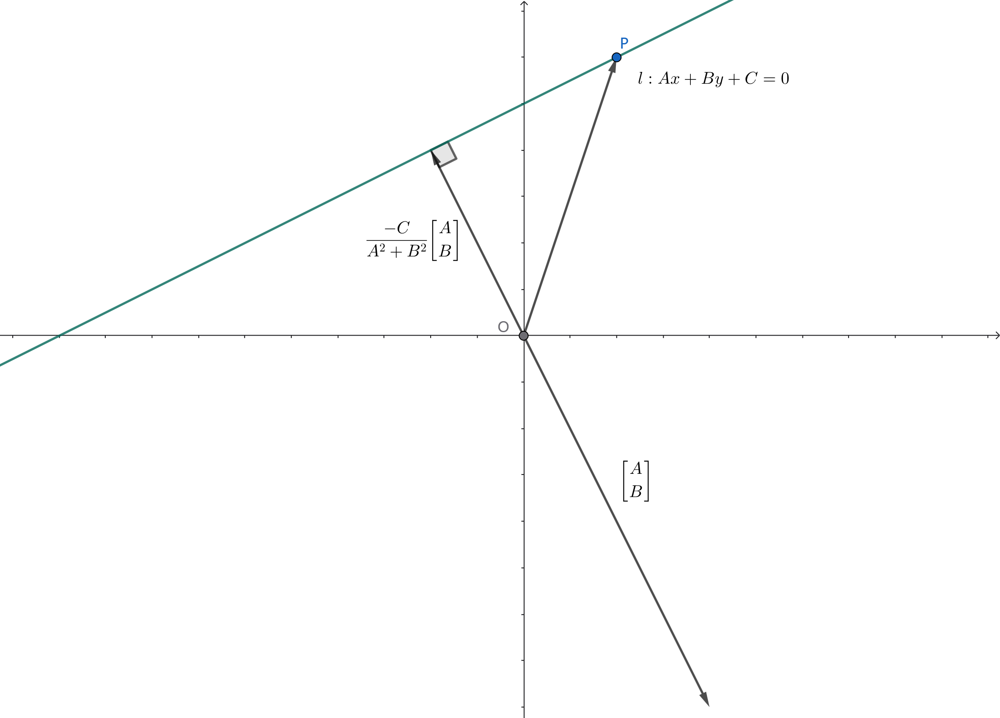

## 高维解析几何

### 超平面及其一般方程

二维空间中，直线的一般方程为

$$Ax+By+C=0\quad(A^2+B^2\not =0)$$

将其改写成以下形式

$${A\brack B}\cdot {x\brack y}=-C\quad(A^2+B^2\not =0)$$

于是可以得到二维空间中直线一般方程的几何意义如下图所示

对直线 $l$ 上任意点 $P$，$\overrightarrow{OP}$ 与非零定向量 $\displaystyle{A\brack B}$ 的内积为定值 $-C$。  
也就是说，$\displaystyle{A\brack B}$ 是一个与直线 $l$ 垂直的非零向量，称为直线 $l$ 的 **法向量**。

这一几何意义显然可以在高维空间中作进一步的推广。例如，三维空间中平面的一般方程为

$$Ax+By+Cz+D=0\quad(A^2+B^2+C^2\not=0)$$

其中 $\begin{bmatrix}A\\ B\\ C\end{bmatrix}$ 是平面的一个法向量。

一般地，我们称 $n$ 维线性空间中的 $n-1$ 维仿射空间为 **超平面**。则超平面的一般方程为

$$\vec{u}^T\vec{r}=C\quad(\vec{u}\not=\vec{0})$$

其中 $\vec{r}=\begin{bmatrix}x_1\\x_2\\ \vdots\\ x_n\end{bmatrix}$，$\vec{u}$ 与超平面垂直，称为超平面的法向量。

超平面一般方程的几何意义使得我们可以通过法向量来处理超平面的平行、垂直、距离等。

> 练习（点到超平面距离公式）：试证明，$n$ 维空间中一点 $P$ 到超平面 $\vec{u}\cdot \vec{r}=C\quad(\vec{u}\not =0)$ 的距离为
> $$\dfrac{\left|\vec{u}\cdot\overrightarrow{OP}-C\right|}{|\vec{u}|}$$

--------------------------------------

$u_n\not =0$ 时，设

$$y=x_n,\vec{x}=\begin{bmatrix}x_1\\x_2\\\vdots\\x_{n-1}\end{bmatrix},\vec{k}=-\dfrac{1}{u_n}\begin{bmatrix}u_1\\u_2\\\vdots\\u_{n-1}\end{bmatrix},b=\dfrac{C}{u_n}$$

则超平面的方程可以写成函数的形式

$$y=\vec{k}^T\vec{x}+b$$

显然 $\vec{k}$ 就是二维空间中的斜率在高维空间的推广，称为超平面的 **梯度**。显然

$$\Delta y=\vec{k}^T\Delta\vec{x}$$

当 $\vec{k}\perp\Delta\vec{x}$ 时，$\Delta y=0$；当 $\vec{k}$ 与 $\Delta \vec{x}$ 同向时，$\dfrac{\Delta y}{|\Delta x|}$ 最大，等于 $|\vec{k}|$。  
也就是说，$n$ 维空间中超平面的梯度是一个 $n-1$ 维向量，其方向就是函数值 $y$ 增长最快的方向，  
其模长就是函数值 $y$ 沿着这个方向的变化率。

### 超球及其一般方程

超球是圆、球等几何对象在高维空间中的推广。其一般方程为

$$(\vec{r}-\vec{r}_0)^2=R^2$$

$\vec{r}_0$ 和 $R>0$ 分别称为超球的圆心和半径。

二维空间中，两圆的方程相减，即可得到两圆交线的方程。同理，对于 $n$ 维空间中的两个超球

$$
\begin{cases}
	(\vec{r}-\vec{r}_0)^2=R_0^2&(1)\\
	(\vec{r}-\vec{r}_1)^2=R_1^2&(2)\\
\end{cases}
$$

将两超球的方程相减，即可得到两超球交面的方程

$$2(\vec{r_0}-\vec{r}_1)\cdot\vec{r}+\vec{r}_0^2-\vec{r}_1^2=R_0^2-R_1^2$$

## 凸包

